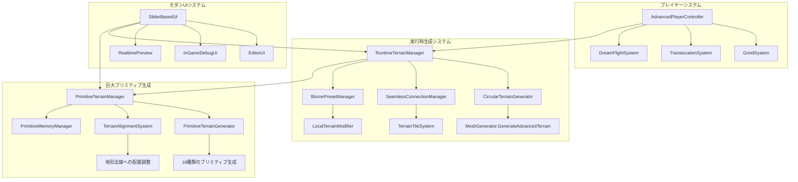

# Vastcore 地形・オブジェクト生成システム 設計文書

## 概要

本設計文書は、要求仕様書に基づき、現在の実装状況を考慮した具体的なシステム設計を定義します。既存の高度なMeshGeneratorとAdvancedPlayerControllerを活用し、実行時動的生成システムへの移行を実現します。

## アーキテクチャ

### システム全体構成



## コンポーネント設計

### 1. 広大地形生成システム

#### 1.1 RuntimeTerrainManager
```csharp
public class RuntimeTerrainManager : MonoBehaviour
{
    [Header("地形設定")]
    public TerrainGenerationParams baseParams;
    public float tileSize = 2000f;
    public int activeTileRadius = 2;
    
    [Header("円形地形設定")]
    public bool useCircularTerrain = true;
    public float circularRadius = 1000f;
    public AnimationCurve edgeFalloff;
    
    [Header("シームレス接続")]
    public bool enableSeamlessConnection = true;
    public float seamlessOverlap = 100f;
    
    private Dictionary<Vector2Int, TerrainTile> activeTiles;
    private Transform playerTransform;
    
    public void Initialize(Transform player);
    public void UpdateTerrainAroundPlayer();
    public TerrainTile GenerateTerrainTile(Vector2Int coordinate);
    public void RemoveDistantTiles();
}
```

#### 1.2 CircularTerrainGenerator
```csharp
public static class CircularTerrainGenerator
{
    public static Mesh GenerateCircularTerrain(TerrainGenerationParams parameters)
    {
        // 既存のMeshGenerator.GenerateAdvancedTerrainを拡張
        var heightmap = GenerateCircularHeightmap(parameters);
        return MeshGenerator.GenerateMeshFromHeightmap(heightmap, parameters);
    }
    
    private static float[,] GenerateCircularHeightmap(TerrainGenerationParams parameters)
    {
        // 円形マスクを適用したハイトマップ生成
        var baseHeightmap = MeshGenerator.GenerateHeightmap(parameters);
        return ApplyCircularMask(baseHeightmap, parameters);
    }
    
    private static float[,] ApplyCircularMask(float[,] heightmap, TerrainGenerationParams parameters)
    {
        // 円形フォールオフの実装
        // 中心からの距離に基づいて高さを調整
    }
}
```

#### 1.3 SeamlessConnectionManager
```csharp
public class SeamlessConnectionManager
{
    public struct ConnectionData
    {
        public Vector2Int tileCoordinate;
        public float[,] edgeHeights;
        public Vector3[] borderVertices;
    }
    
    public static void ApplySeamlessConnection(TerrainTile currentTile, List<TerrainTile> neighborTiles)
    {
        // 隣接タイル間の境界を滑らかに接続
        foreach (var neighbor in neighborTiles)
        {
            BlendTileBorders(currentTile, neighbor);
        }
    }
    
    private static void BlendTileBorders(TerrainTile tile1, TerrainTile tile2)
    {
        // 境界領域での高さ値を補間
        // メッシュ頂点の位置を調整
    }
}
```

### 2. プリセット管理システム

#### 2.1 BiomePresetManager
```csharp
[System.Serializable]
public class BiomePreset
{
    public string name;
    public TerrainGenerationParams terrainParams;
    public StructureSpawnSettings structureSettings;
    public MaterialSettings materialSettings;
    public EnvironmentSettings environmentSettings;
}

public class BiomePresetManager : MonoBehaviour
{
    [Header("プリセット管理")]
    public List<BiomePreset> availablePresets;
    public string presetSavePath = "Assets/Data/BiomePresets/";
    
    public void SavePreset(BiomePreset preset);
    public BiomePreset LoadPreset(string presetName);
    public List<string> GetAvailablePresetNames();
    public void ApplyPresetToTerrain(string presetName, TerrainTile targetTile);
}
```

#### 2.2 LocalTerrainModifier
```csharp
public class LocalTerrainModifier
{
    public struct LocalModification
    {
        public Vector3 center;
        public float radius;
        public AnimationCurve heightCurve;
        public float intensity;
        public ModificationType type;
    }
    
    public enum ModificationType
    {
        Elevation,      // 高度変更
        Smoothing,      // 平滑化
        Roughening,     // 粗面化
        Terracing,      // 段丘化
        Erosion         // 浸食
    }
    
    public static void ApplyLocalModifications(float[,] heightmap, List<LocalModification> modifications)
    {
        foreach (var mod in modifications)
        {
            ApplyModification(heightmap, mod);
        }
    }
}
```

### 3. 巨大プリミティブ地形生成システム

#### 3.1 PrimitiveTerrainManager
```csharp
public class PrimitiveTerrainManager : MonoBehaviour
{
    [Header("プリミティブ地形設定")]
    public List<PrimitiveTerrainRule> primitiveRules;
    public float primitiveCheckRadius = 2000f;
    public int maxActivePrimitives = 20;
    public float minPrimitiveScale = 50f;
    public float maxPrimitiveScale = 500f;
    
    [Header("配置設定")]
    public float minDistanceBetweenPrimitives = 200f;
    public LayerMask terrainLayer;
    public bool alignToTerrainNormal = true;
    
    private Dictionary<Vector3, PrimitiveTerrainObject> activePrimitives;
    private List<Vector3> occupiedPositions;
    
    public void Initialize();
    public void UpdatePrimitivesAroundPlayer(Vector3 playerPosition);
    public PrimitiveTerrainObject SpawnPrimitiveTerrain(PrimitiveTerrainRule rule, Vector3 position);
    public void DespawnDistantPrimitives(Vector3 playerPosition);
}
```

#### 3.2 PrimitiveTerrainRule
```csharp
[System.Serializable]
public class PrimitiveTerrainRule
{
    [Header("プリミティブ設定")]
    public string primitiveName;
    public PrimitiveType primitiveType;
    public float spawnProbability = 0.05f;
    public Vector2 scaleRange = new Vector2(50f, 500f);
    
    [Header("配置条件")]
    public float minDistanceFromPlayer = 200f;
    public float maxDistanceFromPlayer = 2000f;
    public float minTerrainHeight = 10f;
    public float maxTerrainHeight = 150f;
    public float maxTerrainSlope = 45f;
    
    [Header("形状変形")]
    public bool enableDeformation = true;
    public Vector3 deformationRange = Vector3.one;
    public float noiseIntensity = 0.1f;
    public int subdivisionLevel = 2;
    
    [Header("材質設定")]
    public Material[] possibleMaterials;
    public bool randomizeMaterial = true;
    public Color colorVariation = Color.white;
    
    public bool CanSpawnAt(Vector3 position, float terrainHeight, float terrainSlope);
}

public enum PrimitiveType
{
    // 基本プリミティブ
    Cube,           // 巨大立方体
    Sphere,         // 巨大球体
    Cylinder,       // 巨大円柱
    Pyramid,        // 巨大ピラミッド
    
    // 複合プリミティブ
    Torus,          // 巨大トーラス（ドーナツ型）
    Prism,          // 巨大角柱
    Cone,           // 巨大円錐
    Octahedron,     // 巨大八面体
    
    // 特殊プリミティブ
    Crystal,        // 結晶構造
    Monolith,       // モノリス（石柱）
    Arch,           // アーチ構造
    Ring,           // リング構造
    
    // 地形統合プリミティブ
    Mesa,           // メサ（台地）
    Spire,          // 尖塔
    Boulder,        // 巨石
    Formation       // 岩石層
}
```

#### 3.3 PrimitiveTerrainGenerator
```csharp
public static class PrimitiveTerrainGenerator
{
    public static GameObject GeneratePrimitiveTerrain(PrimitiveTerrainRule rule, Vector3 position, Vector3 terrainNormal)
    {
        var primitiveObject = new GameObject($"Primitive_{rule.primitiveName}");
        primitiveObject.transform.position = position;
        
        // 基本プリミティブの生成
        Mesh baseMesh = GenerateBasePrimitive(rule.primitiveType, rule.scaleRange);
        
        // 地形への配置調整
        AlignToTerrain(primitiveObject, terrainNormal, rule.alignToTerrainNormal);
        
        // 形状変形の適用
        if (rule.enableDeformation)
        {
            baseMesh = ApplyDeformation(baseMesh, rule);
        }
        
        // メッシュとマテリアルの設定
        SetupMeshAndMaterial(primitiveObject, baseMesh, rule);
        
        // コライダーの生成
        GenerateCollider(primitiveObject, baseMesh);
        
        return primitiveObject;
    }
    
    private static Mesh GenerateBasePrimitive(PrimitiveType type, Vector2 scaleRange)
    {
        float scale = Random.Range(scaleRange.x, scaleRange.y);
        
        switch (type)
        {
            case PrimitiveType.Cube:
                return GenerateScaledCube(scale);
            case PrimitiveType.Sphere:
                return GenerateScaledSphere(scale);
            case PrimitiveType.Cylinder:
                return GenerateScaledCylinder(scale);
            case PrimitiveType.Pyramid:
                return GenerateScaledPyramid(scale);
            case PrimitiveType.Torus:
                return GenerateScaledTorus(scale);
            case PrimitiveType.Crystal:
                return GenerateCrystalStructure(scale);
            case PrimitiveType.Monolith:
                return GenerateMonolith(scale);
            case PrimitiveType.Mesa:
                return GenerateMesa(scale);
            default:
                return GenerateScaledCube(scale);
        }
    }
    
    private static Mesh ApplyDeformation(Mesh baseMesh, PrimitiveTerrainRule rule)
    {
        var vertices = baseMesh.vertices;
        
        // ノイズベースの変形
        for (int i = 0; i < vertices.Length; i++)
        {
            Vector3 vertex = vertices[i];
            
            // Perlinノイズによる変形
            float noiseX = Mathf.PerlinNoise(vertex.x * 0.1f, vertex.z * 0.1f);
            float noiseY = Mathf.PerlinNoise(vertex.y * 0.1f, vertex.x * 0.1f);
            float noiseZ = Mathf.PerlinNoise(vertex.z * 0.1f, vertex.y * 0.1f);
            
            Vector3 deformation = new Vector3(noiseX, noiseY, noiseZ) * rule.noiseIntensity;
            deformation = Vector3.Scale(deformation, rule.deformationRange);
            
            vertices[i] = vertex + deformation;
        }
        
        var deformedMesh = new Mesh();
        deformedMesh.vertices = vertices;
        deformedMesh.triangles = baseMesh.triangles;
        deformedMesh.uv = baseMesh.uv;
        deformedMesh.RecalculateNormals();
        deformedMesh.RecalculateBounds();
        
        return deformedMesh;
    }
    
    // 各プリミティブ生成メソッド
    private static Mesh GenerateScaledCube(float scale)
    {
        // ProBuilderを使用した立方体生成
        var cube = ShapeGenerator.CreateShape(ShapeType.Cube);
        cube.transform.localScale = Vector3.one * scale;
        return cube.mesh;
    }
    
    private static Mesh GenerateCrystalStructure(float scale)
    {
        // 結晶構造の生成（複数の角錐を組み合わせ）
        var crystal = new Mesh();
        // 複雑な結晶形状の生成ロジック
        return crystal;
    }
    
    private static Mesh GenerateMonolith(float scale)
    {
        // 縦長の石柱構造
        var monolith = ShapeGenerator.CreateShape(ShapeType.Cube);
        monolith.transform.localScale = new Vector3(scale * 0.3f, scale * 2f, scale * 0.3f);
        return monolith.mesh;
    }
    
    private static Mesh GenerateMesa(float scale)
    {
        // 台地状の地形プリミティブ
        var mesa = ShapeGenerator.CreateShape(ShapeType.Cylinder);
        mesa.transform.localScale = new Vector3(scale * 2f, scale * 0.3f, scale * 2f);
        return mesa.mesh;
    }
}
```

### 4. 独特プレイヤー操作システム（既存システム拡張）

#### 4.1 GrindSystemEnhancement
```csharp
public class EnhancedGrindSystem : MonoBehaviour
{
    [Header("グラインド改良")]
    public float grindAcceleration = 2f;
    public float maxGrindSpeed = 30f;
    public AnimationCurve speedCurve;
    public ParticleSystem grindEffect;
    
    [Header("表面検出")]
    public LayerMask grindableSurfaces;
    public float surfaceSnapDistance = 1f;
    
    public void UpdateGrindSystem()
    {
        // より滑らかで爽快なグラインド実装
        if (IsGrinding())
        {
            ApplyGrindPhysics();
            UpdateGrindEffects();
            CheckGrindContinuity();
        }
    }
}
```

#### 4.2 TranslocationSystemEnhancement
```csharp
public class EnhancedTranslocationSystem : MonoBehaviour
{
    [Header("軌道予測改良")]
    public LineRenderer trajectoryLine;
    public int trajectoryPoints = 50;
    public float trajectoryTimeStep = 0.1f;
    
    [Header("着地プレビュー")]
    public GameObject landingPreview;
    public float previewUpdateRate = 0.1f;
    
    public void UpdateTrajectoryPrediction()
    {
        // より正確な軌道予測
        var trajectory = CalculateTrajectory();
        DisplayTrajectory(trajectory);
        UpdateLandingPreview(trajectory);
    }
    
    private Vector3[] CalculateTrajectory()
    {
        // 物理演算を考慮した正確な軌道計算
        // 風の影響、重力、空気抵抗を含む
    }
}
```

### 5. モダンUI設計システム

#### 5.1 SliderBasedUISystem
```csharp
public class SliderBasedUISystem : MonoBehaviour
{
    [Header("UI設定")]
    public bool useModernDesign = true;
    public Color primaryColor = Color.blue;
    public Color accentColor = Color.cyan;
    public Font modernFont;
    
    [Header("スライダー設定")]
    public float sliderSensitivity = 1f;
    public bool enableRealtimeUpdate = true;
    public float updateThrottle = 0.1f;
    
    public void CreateSliderUI(string parameterName, float minValue, float maxValue, float currentValue, System.Action<float> onValueChanged)
    {
        // モダンなスライダーUIの生成
        var sliderObject = CreateModernSlider();
        ConfigureSlider(sliderObject, minValue, maxValue, currentValue);
        BindSliderEvents(sliderObject, onValueChanged);
    }
}
```

#### 5.2 RealtimePreviewSystem
```csharp
public class RealtimePreviewSystem : MonoBehaviour
{
    [Header("プレビュー設定")]
    public Camera previewCamera;
    public RenderTexture previewTexture;
    public float previewUpdateRate = 30f;
    
    [Header("プレビュー対象")]
    public GameObject previewTarget;
    public bool autoRotatePreview = true;
    public float rotationSpeed = 30f;
    
    public void UpdatePreview()
    {
        if (enableRealtimeUpdate && Time.time - lastUpdateTime > 1f / previewUpdateRate)
        {
            RenderPreview();
            lastUpdateTime = Time.time;
        }
    }
    
    private void RenderPreview()
    {
        // リアルタイムプレビューの描画
        previewCamera.targetTexture = previewTexture;
        previewCamera.Render();
    }
}
```

### 6. 実行時動的生成システム

#### 6.1 RuntimeGenerationManager
```csharp
public class RuntimeGenerationManager : MonoBehaviour
{
    [Header("実行時生成設定")]
    public bool enableRuntimeGeneration = true;
    public float generationRadius = 1000f;
    public int maxGenerationPerFrame = 5;
    
    [Header("負荷分散")]
    public bool enableLoadBalancing = true;
    public float targetFrameTime = 16.67f; // 60FPS
    public int maxGenerationTime = 5; // ms
    
    private Queue<GenerationTask> generationQueue;
    private Coroutine generationCoroutine;
    
    public void QueueGeneration(GenerationTask task)
    {
        generationQueue.Enqueue(task);
        
        if (generationCoroutine == null)
        {
            generationCoroutine = StartCoroutine(ProcessGenerationQueue());
        }
    }
    
    private IEnumerator ProcessGenerationQueue()
    {
        while (generationQueue.Count > 0)
        {
            var startTime = System.DateTime.Now;
            int processedCount = 0;
            
            while (generationQueue.Count > 0 && processedCount < maxGenerationPerFrame)
            {
                var task = generationQueue.Dequeue();
                ProcessGenerationTask(task);
                processedCount++;
                
                // フレーム時間制限チェック
                var elapsedTime = (System.DateTime.Now - startTime).TotalMilliseconds;
                if (elapsedTime > maxGenerationTime)
                {
                    break;
                }
            }
            
            yield return null; // 次のフレームまで待機
        }
        
        generationCoroutine = null;
    }
}
```

## データモデル

### TerrainTile
```csharp
public class TerrainTile
{
    public Vector2Int coordinate;
    public GameObject terrainObject;
    public Mesh terrainMesh;
    public float[,] heightData;
    public List<GameObject> structures;
    public BiomePreset appliedBiome;
    public bool isActive;
    public float lastAccessTime;
}
```

### GenerationTask
```csharp
public class GenerationTask
{
    public enum TaskType
    {
        TerrainGeneration,
        StructureSpawn,
        BuildingGeneration,
        BiomeApplication
    }
    
    public TaskType type;
    public Vector3 position;
    public Dictionary<string, object> parameters;
    public System.Action<GameObject> onComplete;
    public int priority;
}
```

## エラーハンドリング

### 1. 地形生成エラー
- ハイトマップ生成失敗時のフォールバック
- メモリ不足時の解像度自動調整
- 無効なパラメータの自動修正

### 2. 構造物生成エラー
- ProBuilder API エラーの処理
- 構造物配置衝突の回避
- メモリリーク防止

### 3. UI応答性エラー
- スライダー値の範囲外処理
- リアルタイム更新の負荷制限
- プレビュー生成失敗時の対応

## テスト戦略

### 1. 単体テスト
- 各生成アルゴリズムの正確性
- パラメータ範囲の妥当性
- メモリ使用量の測定

### 2. 統合テスト
- 地形とオブジェクトの連携
- プレイヤー移動との同期
- UI操作の反映確認

### 3. パフォーマンステスト
- 大規模地形での動作確認
- 長時間プレイでのメモリリーク検証
- フレームレート維持の確認
##
## 3.4 PrimitiveTerrainObject
```csharp
public class PrimitiveTerrainObject : MonoBehaviour
{
    [Header("プリミティブ情報")]
    public PrimitiveType primitiveType;
    public float scale;
    public Vector3 originalPosition;
    public bool isAlignedToTerrain;
    
    [Header("動的調整")]
    public bool enableLOD = true;
    public float[] lodDistances = { 500f, 1000f, 2000f };
    public Mesh[] lodMeshes;
    
    [Header("インタラクション")]
    public bool isClimbable = true;
    public bool isGrindable = true;
    public bool hasCollision = true;
    
    private MeshRenderer meshRenderer;
    private MeshCollider meshCollider;
    private int currentLOD = 0;
    
    public void Initialize(PrimitiveTerrainRule rule, Vector3 position)
    {
        primitiveType = rule.primitiveType;
        originalPosition = position;
        
        SetupComponents();
        GenerateLODMeshes();
    }
    
    public void UpdateLOD(float distanceToPlayer)
    {
        int newLOD = CalculateLOD(distanceToPlayer);
        if (newLOD != currentLOD)
        {
            ApplyLOD(newLOD);
            currentLOD = newLOD;
        }
    }
    
    private int CalculateLOD(float distance)
    {
        for (int i = 0; i < lodDistances.Length; i++)
        {
            if (distance < lodDistances[i])
                return i;
        }
        return lodDistances.Length;
    }
    
    private void ApplyLOD(int lodLevel)
    {
        if (lodLevel < lodMeshes.Length)
        {
            GetComponent<MeshFilter>().mesh = lodMeshes[lodLevel];
        }
        else
        {
            // 最遠距離では非表示
            meshRenderer.enabled = false;
            meshCollider.enabled = false;
        }
    }
}
```

#### 3.5 TerrainAlignmentSystem
```csharp
public static class TerrainAlignmentSystem
{
    public static void AlignPrimitiveToTerrain(GameObject primitive, Vector3 terrainNormal, bool enableAlignment)
    {
        if (!enableAlignment) return;
        
        // 地形の法線に基づいて回転を調整
        Vector3 up = Vector3.up;
        Vector3 forward = Vector3.Cross(terrainNormal, primitive.transform.right).normalized;
        Vector3 right = Vector3.Cross(up, forward).normalized;
        
        primitive.transform.rotation = Quaternion.LookRotation(forward, terrainNormal);
        
        // 地形に埋め込まれないよう高さを調整
        AdjustHeightForTerrain(primitive, terrainNormal);
    }
    
    private static void AdjustHeightForTerrain(GameObject primitive, Vector3 terrainNormal)
    {
        // プリミティブの境界ボックスを取得
        Bounds bounds = primitive.GetComponent<MeshRenderer>().bounds;
        
        // 地形表面からの適切な距離を計算
        float heightOffset = bounds.size.y * 0.1f; // 10%地面に埋める
        
        Vector3 adjustedPosition = primitive.transform.position + terrainNormal * heightOffset;
        primitive.transform.position = adjustedPosition;
    }
    
    public static bool IsValidPlacementPosition(Vector3 position, float radius, List<Vector3> occupiedPositions, float minDistance)
    {
        foreach (var occupied in occupiedPositions)
        {
            if (Vector3.Distance(position, occupied) < minDistance + radius)
            {
                return false;
            }
        }
        return true;
    }
    
    public static Vector3 FindNearestValidPosition(Vector3 desiredPosition, float radius, List<Vector3> occupiedPositions, float minDistance, int maxAttempts = 10)
    {
        for (int i = 0; i < maxAttempts; i++)
        {
            Vector3 randomOffset = Random.insideUnitSphere * minDistance * 2f;
            randomOffset.y = 0; // Y軸方向のオフセットは無効
            
            Vector3 testPosition = desiredPosition + randomOffset;
            
            if (IsValidPlacementPosition(testPosition, radius, occupiedPositions, minDistance))
            {
                return testPosition;
            }
        }
        
        // 有効な位置が見つからない場合は元の位置を返す
        return desiredPosition;
    }
}
```

### プリミティブ地形の詳細仕様

#### サイズ仕様
- **小型プリミティブ**: 50-100m（プレイヤーが登れるサイズ）
- **中型プリミティブ**: 100-300m（ランドマークとなるサイズ）
- **大型プリミティブ**: 300-500m（遠くからも見える巨大サイズ）

#### 配置密度
- **高密度エリア**: 200m間隔（探索重点エリア）
- **中密度エリア**: 500m間隔（通常エリア）
- **低密度エリア**: 1000m間隔（広大な空間演出）

#### 地形統合
- **地面埋め込み**: プリミティブの10-20%を地面に埋め込み自然な配置
- **法線整列**: 地形の傾斜に合わせてプリミティブを回転
- **高さ調整**: 地形の起伏に応じた適切な配置高度

#### インタラクション対応
- **クライミング**: 表面にクライミング可能なコライダー設定
- **グラインド**: エッジ部分にグラインド可能な判定
- **ワープ着地**: 上部平面にワープ着地ポイント設定