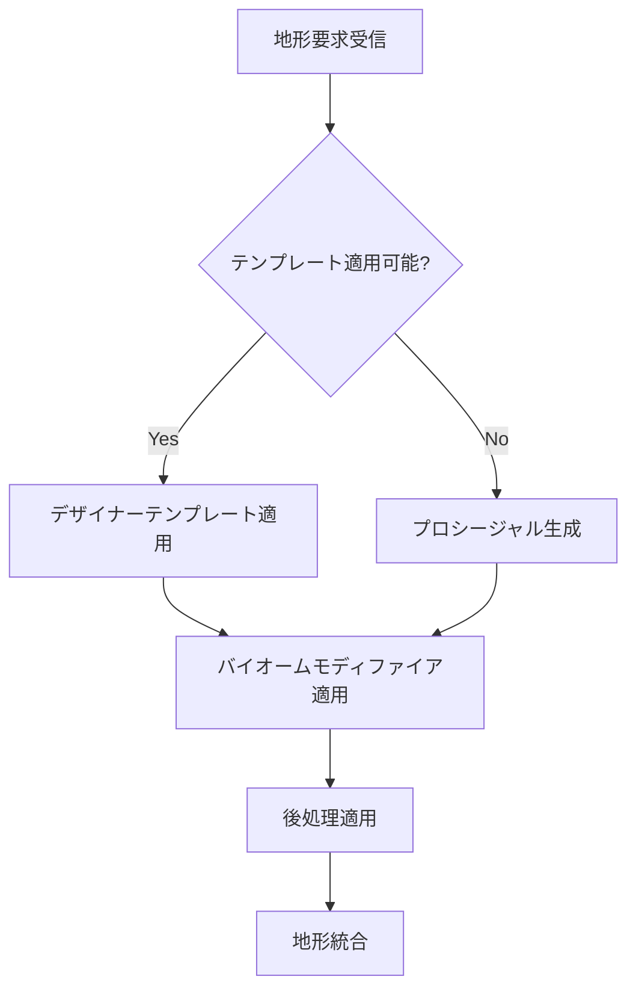

# VastCore地形生成エンジン仕様書 (OpenSpec v1.0)

## 概要

VastCore地形生成エンジンは、デザイナードリブンの柔軟な地形生成システムを提供します。従来のプロシージャル生成中心のアプローチから、デザイナーが作成したテンプレートを基調としたハイブリッド生成方式に移行しました。

## アーキテクチャ概要

### 主要コンポーネント

#### 1. DesignerTerrainTemplate (デザイナーテンプレート)
- **目的**: デザイナーが手動で作成した地形パターンを定義
- **実装**: `Assets/Scripts/Generation/Map/DesignerTerrainTemplate.cs`
- **機能**:
  - ハイトマップ画像からの地形生成
  - 自動バリエーション生成（反転、スケーリング）
  - バイオームごとのテンプレート分類
  - ブレンド設定と遷移制御

#### 2. TerrainSynthesizer (地形合成エンジン)
- **目的**: テンプレートベースの地形自動生成
- **実装**: `Assets/Scripts/Generation/Map/TerrainSynthesizer.cs`
- **機能**:
  - 画像ベース地形生成
  - 複数テンプレートブレンド
  - 自然なバリエーション追加
  - リアルワールド地図統合

#### 3. BiomeSpecificTerrainGenerator (バイオーム特化生成器)
- **目的**: ハイブリッド生成（テンプレート優先＋プロシージャルフォールバック）
- **実装**: `Assets/Scripts/Terrain/Map/BiomeSpecificTerrainGenerator.cs`
- **機能**:
  - デザイナーテンプレート適用
  - バイオーム固有モディファイア適用
  - プロシージャル生成フォールバック
  - 地形特徴フィルタリング

#### 4. TerrainEngine (統合管理エンジン)
- **目的**: 地形生成のライフサイクル管理
- **実装**: `Assets/Scripts/Generation/Map/TerrainEngine.cs`
- **機能**:
  - 同期/非同期生成モード
  - タイル管理システム
  - 生成モード選択（テンプレート専用/プロシージャル専用/ハイブリッド）
  - パフォーマンス監視

### 生成フロー



## API仕様

### DesignerTerrainTemplate API

#### プロパティ
```csharp
public class DesignerTerrainTemplate : ScriptableObject
{
    [Header("基本設定")]
    public string templateName;
    public BiomeType targetBiome;
    public TerrainTemplateType templateType;

    [Header("地形データ")]
    public Texture2D heightmapTexture;
    public float heightScale = 1.0f;
    public float baseHeight = 0.0f;

    [Header("バリエーション")]
    public bool enableVariations = true;
    public Vector2 scaleRange = new Vector2(0.8f, 1.2f);
    public Vector2 rotationRange = new Vector2(-15f, 15f);
    public bool allowFlipHorizontal = true;
    public bool allowFlipVertical = false;
}
```

#### メソッド
```csharp
// テンプレート適用
public TerrainData ApplyTemplate(Vector3 worldPosition, TerrainSettings settings)

// バリエーション生成
public DesignerTerrainTemplate GenerateVariation(int seed)

// ブレンド設定取得
public BlendSettings GetBlendSettings()
```

### TerrainSynthesizer API

#### 静的メソッド
```csharp
public static class TerrainSynthesizer
{
    // 画像ベース生成
    public static TerrainData GenerateFromHeightmapImage(
        Texture2D heightmap,
        Texture2D? realWorldMap,
        Vector3 worldPosition,
        TerrainSynthesisSettings settings
    )

    // テンプレート合成
    public static TerrainData SynthesizeFromTemplates(
        DesignerTerrainTemplate[] templates,
        Vector3 worldPosition,
        SynthesisSettings settings
    )

    // ブレンド適用
    public static void ApplyBlend(
        TerrainData terrain,
        BlendMode mode,
        float strength
    )
}
```

### TerrainEngine API

#### プロパティ
```csharp
public class TerrainEngine : MonoBehaviour
{
    [Header("生成設定")]
    public TerrainGenerationMode generationMode = TerrainGenerationMode.Hybrid;
    public bool enableAsyncGeneration = true;
    public int maxConcurrentTiles = 4;

    [Header("テンプレート管理")]
    public DesignerTerrainTemplate[] availableTemplates;
    public BiomeSystem biomeSystem;

    [Header("パフォーマンス")]
    public float targetFrameRate = 60f;
    public bool enableQualityScaling = true;
}
```

#### メソッド
```csharp
// タイル生成要求
public void RequestTileGeneration(Vector2Int tileCoord, Action<TerrainData> callback)

// 生成モード設定
public void SetGenerationMode(TerrainGenerationMode mode)

// パフォーマンス監視
public PerformanceMetrics GetPerformanceMetrics()
```

## 生成モード仕様

### 1. TemplateOnly モード
- デザイナーテンプレートのみを使用
- 適用可能なテンプレートがない場合は空の地形生成
- 最も予測可能で制御しやすいモード

### 2. ProceduralOnly モード
- 従来のプロシージャル生成のみ
- テンプレートを一切使用しない
- バックワード互換性確保

### 3. Hybrid モード (デフォルト)
- テンプレート優先でプロシージャルフォールバック
- 最も柔軟で推奨されるモード
- パフォーマンスと品質のバランス

## 拡張性仕様

### テンプレートタイプ
```csharp
public enum TerrainTemplateType
{
    Heightmap,      // ハイトマップベース
    Feature,        // 地形特徴（岩山、谷など）
    BiomeModifier,  // バイオーム固有モディファイア
    Coastal,        // 海岸線専用
    Mountain,       // 山岳専用
    Custom          // カスタム拡張用
}
```

### ブレンドモード
```csharp
public enum BlendMode
{
    Additive,       // 加算ブレンド
    Multiplicative, // 乗算ブレンド
    Overlay,        // オーバーレイ
    Smooth,         // スムーズ遷移
    Sharp           // シャープ境界
}
```

## エディター拡張仕様

### 主要UIコンポーネント

#### TerrainTemplateEditor
スライダー中心のキャラクターエディター風インターフェース：
- リアルタイムプレビュー
- スライダーによるパラメータ調整
- 自動バリエーション生成
- ブレンド設定GUI

#### AssetBrowser
ツリーペイン＋画像一覧表示：
- バイオーム別テンプレート分類
- サムネイル表示
- 検索・フィルタリング機能
- ドラッグ＆ドロップ配置

### ワークフロー

1. **テンプレート作成**: AssetBrowserで新規テンプレート作成
2. **地形編集**: TerrainTemplateEditorでパラメータ調整
3. **プレビュー**: リアルタイム地形プレビュー
4. **適用**: シーンへのテンプレート適用

## パフォーマンス仕様

### ターゲット性能
- **同期生成**: 16ms以下（60FPS維持）
- **非同期生成**: バックグラウンド処理
- **メモリ使用**: タイルあたり最大50MB
- **LOD対応**: 距離ベース品質スケーリング

### 最適化機能
- タイルベース分割生成
- プーリングシステム
- メモリ管理
- CPU/GPU並列処理

## テスト仕様

### ユニットテスト
- 各コンポーネントの独立テスト
- API互換性テスト
- パフォーマンス回帰テスト

### 統合テスト
- エンドツーエンド生成テスト
- 複数テンプレートブレンドテスト
- メモリリークテスト

## 移行ガイド

### 既存コードからの移行
1. BiomeSpecificTerrainGeneratorの参照をTerrainEngineに変更
2. プロシージャル生成コードをTerrainModifierとして分離
3. テンプレートベースのワークフロー採用

### 互換性確保
- 既存APIの維持
- プロシージャル専用モードの提供
- 段階的移行パス

## バージョン履歴

### v1.0.0 (現在)
- デザイナーテンプレートシステム導入
- ハイブリッド生成モード実装
- 統合TerrainEngine実装

### 今後予定
- v1.1.0: エディター拡張強化
- v1.2.0: ランタイムテンプレート編集
- v2.0.0: 3Dボクセル地形サポート
