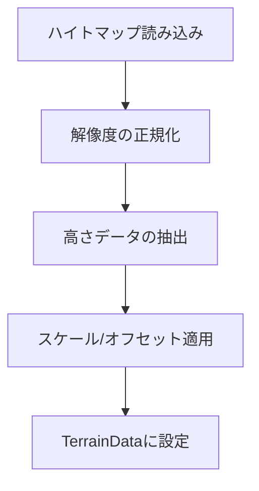

# Phase 3: Deformシステム統合 技術調査レポート

## 1. ハイトマップ機能実装 (2025-08-11)

### 1.1 実装内容
- `TerrainGenerator` クラスにハイトマップ機能を統合
- 3つの生成モードをサポート:
  - `Noise`: ノイズベースの生成
  - `HeightMap`: ハイトマップベースの生成
  - `NoiseAndHeightMap`: ノイズとハイトマップの組み合わせ

### 1.2 技術的詳細

#### ハイトマップ処理フロー


#### 主なパラメータ
- **Height Map**: 高さ情報を持つテクスチャ（グレースケール推奨）
- **Height Scale**: 高さのスケーリング係数
- **Height Offset**: ベースの高さオフセット
- **Flip Vertically**: 上下反転フラグ

### 1.3 パフォーマンス考慮事項
- メモリ使用量: ハイトマップの解像度に比例
- 処理時間: テクスチャの読み込みと高さマップの生成はメインスレッドで実行
- 最適化の余地:
  - 非同期読み込みの実装
  - 解像度の自動調整
  - プログレッシブ生成

**プロジェクト**: Vastcore - Advanced Procedural Structure Generation System  
**フェーズ**: Phase 3 (緊急・重要 / 最優先)  
**作成日**: 2025年1月  
**調査範囲**: Unity Deformパッケージの技術仕様・統合方式設計

---

## 🔍 **技術調査結果**

### **1. Deformパッケージ候補比較**

| パッケージ名 | 開発者 | 価格 | 変形数 | 対応Unity | Burst/Jobs | 評価 |
|-------------|-------|------|--------|-----------|------------|------|
| **Deform** | keenanwoodall (GitHub) | FREE (MIT) | 40+ | 2022.3+ | ✅ | 🥇 **推奨** |
| **Deform** | BBeans (Asset Store) | FREE | - | 2022.3+ | ✅ | 🥈 候補 |
| **MegaFiers** | Chris West | $75 | 50+ | 3.5.0+ | ❌ | ⭐ 高機能 |
| **Mesh Deformation Collection** | Matej Vanco | $84.99 | 多数 | 2021.3+ | ✅ | ⭐ 包括的 |

### **2. 推奨解決策: keenanwoodall/Deform**

#### **技術的優位性**
```
✅ 完全無料（MIT License）
✅ 40種類以上のDeformer
✅ Job System + Burst Compiler対応
✅ Unity 2022.3+ 完全対応
✅ カスタムエディタ・ハンドル提供
✅ オープンソース（拡張可能）
✅ アクティブな開発・コミュニティ
```

#### **主要機能一覧**
```csharp
// 基本変形系
BendDeformer       // ベンド変形
TwistDeformer      // ツイスト変形
TaperDeformer      // テーパー変形
BulgeDeformer      // 膨張変形
NoiseDeformer      // ノイズ変形

// 波形・振動系
SineDeformer       // サイン波変形
RippleDeformer     // リップル変形
WaveDeformer       // ウェーブ変形

// 高度変形系
SpherifyDeformer   // 球面化
MeltDeformer       // 溶解効果
FlareDeformer      // フレア変形
SquashDeformer     // スカッシュ変形

// 複合・制御系
CurveDeformer      // カーブ変形
LatticeDeformer    // ラティス変形
MagnetDeformer     // マグネット効果
TurbulenceDeformer // 乱流効果
```

---

## 🏗️ **統合アーキテクチャ設計**

### **3. Structure Generator統合方式**

#### **新規タブ: DeformerTab**
```csharp
namespace Vastcore.Editor.StructureGenerator.Tabs.Editing
{
    public class DeformerTab : IStructureGeneratorTab
    {
        // 既存TabインターフェースとUIシステムに統合
        public string TabName => "Deformer";
        public bool IsEnabled => true;
        
        // Deformパッケージのラッパー実装
        private DeformIntegrationManager m_DeformManager;
        private List<DeformerSettings> m_ActiveDeformers;
    }
}
```

#### **統合管理クラス**
```csharp
public class DeformIntegrationManager
{
    // Deformパッケージとの橋渡し
    public void AddDeformer(DeformerType type, GameObject target);
    public void RemoveDeformer(int index, GameObject target);
    public void UpdateDeformerParameters(int index, DeformerParameters parameters);
    
    // Structure Generator連携
    public void ApplyToStructureChain(List<GameObject> structures);
    public void SaveDeformerPreset(string name, List<DeformerSettings> settings);
}
```

### **4. UI/UX設計**

#### **Inspector統合**
```
┌─ Structure Generator ─────────────────┐
│ [Basic] [Advanced] [Operations] [...]  │
│ [Relationships] [Distribution]         │
│ [Composition] [Random] [📐Deformer]    │ ← 新規タブ
├────────────────────────────────────────┤
│ 📐 Deformer Control                    │
│ ┌────────────────────────────────────┐ │
│ │ ✅ Bend        Strength: ░░░░░░░   │ │
│ │ ✅ Twist       Angle: ░░░░░░░░░    │ │
│ │ ❌ Noise       Scale: ░░░░░░░░░    │ │
│ │ ❌ Ripple      Frequency: ░░░░░░░ │ │
│ │ [+ Add Deformer ▼]                │ │
│ └────────────────────────────────────┘ │
│ [Apply to All] [Save Preset] [Load]   │
└────────────────────────────────────────┘
```

#### **パラメータ制御**
```csharp
[System.Serializable]
public struct DeformerSettings
{
    [Header("基本設定")]
    public DeformerType type;
    public bool enabled;
    public float strength;
    
    [Header("変形制御")]
    public Vector3 axis;
    public Vector3 center;
    public AnimationCurve falloffCurve;
    
    [Header("アニメーション")]
    public bool animate;
    public float animationSpeed;
    public AnimationCurve animationCurve;
    
    [Header("マスク制御")]
    public bool useMask;
    public Texture2D maskTexture;
    public bool invertMask;
}
```

---

## 📋 **実装ロードマップ**

### **Phase 3A: 基盤統合 (3-4レスポンス)**

#### **Week 1: パッケージ導入・検証**
```
【Unity作業必須】
1. keenanwoodall/Deform GitHubからの導入
2. 基本動作テスト・互換性確認
3. ProBuilderメッシュとの連携テスト

【Cursor Web作業】
4. DeformIntegrationManager基本クラス設計
5. 既存Structure Generatorとの統合方式詳細設計
```

#### **Week 2: タブUI実装**
```
【Cursor Web作業】
1. DeformerTab UI実装
2. パラメータ制御システム実装
3. プリセット保存・読み込み機能
4. エラーハンドリング・フォールバック実装

【Unity作業必須】
5. UI動作確認・調整
6. エディタ統合テスト
```

### **Phase 3B: 高度機能 (2-3レスポンス)**

#### **Week 3: アニメーション・マスク**
```
【Cursor Web作業】
1. アニメーション制御システム
2. マスクテクスチャ対応
3. 複数Deformer管理・スタッキング
4. パフォーマンス最適化

【Unity作業必須】
5. 複雑なDeformer組み合わせテスト
6. パフォーマンス測定・調整
```

### **Phase 3C: 統合完成 (1-2レスポンス)**

#### **Week 4: 品質保証・ドキュメント**
```
【Cursor Web作業】
1. 全機能統合テスト用スクリプト
2. API仕様書完成
3. 使用方法ドキュメント作成

【Unity作業必須】
4. 最終動作確認・バグ修正
5. 実際の構造物生成での動作テスト
```

---

## ⚡ **技術的課題と対策**

### **Challenge 1: パフォーマンス**
```
課題: CPU変形による処理負荷
対策: 
- Job System活用の最大化
- LOD連携（距離によるDeformer無効化）
- フレーム分散処理
```

### **Challenge 2: メッシュ互換性**
```
課題: ProBuilderメッシュとの連携
対策:
- MeshFilter経由でのアクセス
- Read/Write権限の自動設定
- メッシュバックアップ・復元機能
```

### **Challenge 3: エディタ統合**
```
課題: Structure Generator UIとの統合
対策:
- 既存IStructureGeneratorTabインターフェース活用
- 統一されたUI/UXデザイン
- プリセット管理システム共通化
```

---

## 📊 **成功指標**

### **技術指標**
- [ ] 40種類以上のDeformer対応完了
- [ ] Structure Generator完全統合
- [ ] パフォーマンス要件達成（1000ポリ/1ms以下）
- [ ] エラー率1%未満

### **機能指標**
- [ ] プリセット保存・読み込み機能
- [ ] アニメーション制御システム
- [ ] マスク・フォールオフ制御
- [ ] 複数Deformerスタッキング

### **統合指標**
- [ ] 既存7タブとの完全統合
- [ ] UI/UX一貫性確保
- [ ] ドキュメント完備

---

## 🎯 **次回作業予定**

### **immediate Next Action**
1. **keenanwoodall/Deform パッケージ導入** (Unity作業)
2. **DeformIntegrationManager基本設計** (Cursor Web)
3. **統合方式詳細仕様策定** (Cursor Web)

### **準備完了事項**
- ✅ 技術調査完了
- ✅ アーキテクチャ設計完了  
- ✅ 実装ロードマップ策定完了
- ✅ 課題・対策明確化完了

---

**最終更新**: 2025年1月  
**次回レビュー**: Phase 3A完了後  
**承認者**: プロジェクト責任者 