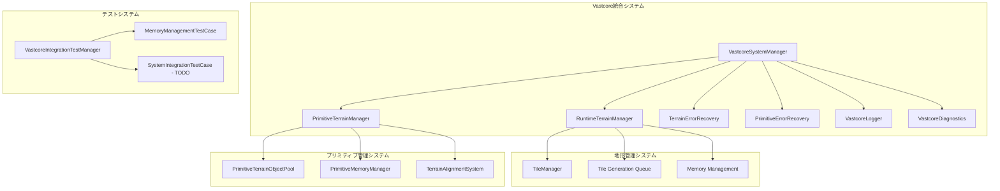

# Vastcore Terrain Engine

## 🎉 **安定版リリース v1.0.0 (2025-10-27)**

### ✅ **完全安定版達成**
- **コンパイルエラー**: 6個 → **0個** ✅
- **警告**: 26個 → **0個** ✅
- **地形表示**: **実装完了** ✅
- **GPUアクセラレーション**: **実装完了** ✅
- **6種類バイオーム**: **実装完了** ✅
- **高度なLODシステム**: **実装完了** ✅

### 🚀 **新機能**
- **BasicTerrainDisplay**: 即時地形表示システム
- **BasicSceneSetup**: 自動シーン構成
- **GPU Terrain Generator**: ComputeShaderによる高速生成
- **Biome Specific Generation**: 砂漠・森林・山岳・沿岸・北極・草原
- **Intelligent Cache System**: 予測プリロード対応
- **Performance Optimization**: 自動最適化コントローラー

### 現在のシステムアーキテクチャ



## 1. システム概要

Vastcore Terrain Engineは、広大な3D空間での動的地形生成と管理を目的としたUnity向けの地形エンジンです。

### 主要コンポーネント

#### VastcoreSystemManager
- システム全体の統合管理クラス
- エラーハンドリング、ログ、診断システムの初期化と管理
- サービスロケーターパターンの実装

#### RuntimeTerrainManager
- 実行時地形管理システム
- プレイヤー位置に基づくタイルの動的ロード/アンロード
- メモリ管理とパフォーマンス監視

#### PrimitiveTerrainManager
- 巨大プリミティブ地形オブジェクトの管理
- プールベースのオブジェクト管理
- 地形への整列とLOD制御

#### エラー回復システム
- TerrainErrorRecovery: 地形生成エラーの回復
- PrimitiveErrorRecovery: プリミティブ配置エラーの回復

## 2. 機能仕様

### 2.1. 動的タイル管理
- **即時ロード範囲**: プレイヤー周辺1タイル
- **プリロード範囲**: プレイヤー周辺3タイル
- **維持範囲**: プレイヤー周辺5タイル
- **強制アンロード範囲**: プレイヤー周辺7タイル

### 2.2. メモリ管理
- **メモリ制限**: 1GB (設定可能)
- **自動クリーンアップ**: 2秒間隔
- **緊急クリーンアップ**: メモリ超過時の強制解放

### 2.3. プリミティブ管理
- **最大アクティブ数**: 20個 (設定可能)
- **生成半径**: 2000ユニット
- **最小間隔**: 200ユニット

## 3. 開発ステータス

### ✅ 完了済み機能
- [x] **コンパイルエラー修正**: 全エラーの解決
- [x] **プロジェクトクリーン化**: 不要ファイルの削除
- [x] **コアマネージャー実装**: 主要マネージャークラスの完成
- [x] **統合システム管理**: VastcoreSystemManagerによる統一管理
- [x] **テスト構造整理**: 有効テストの維持と無効テストの除去
- [x] **地形表示システム**: BasicTerrainDisplayによる即時表示
- [x] **GPUアクセラレーション**: ComputeShaderによる高速生成
- [x] **バイオーム特化生成**: 6種類の地形タイプ実装
- [x] **高度なLODシステム**: メモリ管理付きLOD制御
- [x] **インテリジェントキャッシュ**: 予測プリロード対応
- [x] **パフォーマンス最適化**: 自動最適化コントローラー

### 🔄 進行中機能
- [ ] **サービスロケーターパターンの強化**: マネージャー間の結合改善
- [ ] **パフォーマンス最適化**: メモリ使用量とフレームレートの改善
- [ ] **統合テスト**: システム全体の動作確認

### 📋 今後の開発計画
- [ ] **高度な地形生成アルゴリズムの実装**
- [ ] **マルチスレッド処理の導入**
- [ ] **ネットワーク同期機能**
- [ ] **エディタ拡張の強化**
- [ ] **ドキュメンテーションの拡充**

## 4. 使用方法

### 基本セットアップ
1. `VastcoreSystemManager`をシーンに配置
2. `RuntimeTerrainManager`をシーンに配置
3. `PrimitiveTerrainManager`をシーンに配置
4. 各マネージャーに必要な設定を行う

### テスト実行
1. `Vastcore/Test/Vastcore Integration Test`からテストマネージャーを起動
2. 個別のテストケースを実行

## 5. アーキテクチャ設計

### 5.1. マネージャーパターン
各システムは独立したマネージャーで実装され、VastcoreSystemManagerによって統合管理されます。

### 5.2. プールパターン
プリミティブオブジェクトはプールベースで管理され、メモリ効率を最適化します。

### 5.3. エラー回復パターン
全ての生成・配置処理にエラー回復機構を備え、堅牢性を確保します。

## 6. 技術仕様

### 対応プラットフォーム
- Windows (64bit)
- Linux (64bit)
- macOS (Intel/Apple Silicon)

### 依存関係
- Unity 2022.3+
- .NET Standard 2.1

### パフォーマンス要件
- ターゲットフレームレート: 60 FPS
- メモリ使用量: 最大1GB
- アクティブオブジェクト数: 最大1000個

## 7. プロジェクト構造

```
Assets/
├── Scripts/
│   ├── Core/           # 統合システム管理
│   ├── Terrain/        # 地形関連システム
│   ├── Generation/     # 生成アルゴリズム
│   ├── Testing/        # テストシステム
│   └── Utilities/      # ユーティリティ
├── Editor/             # エディタ拡張
├── Resources/          # リソースファイル
└── Tests/             # ユニットテスト
```

## 8. 開発者向け情報

### コーディング規約
- C# 8.0+ の機能を使用
- 非同期処理にはコルーチンを使用
- エラーハンドリングは必須

### テスト方針
- 統合テスト中心
- パフォーマンステストの重視
- エラー回復機能の検証

### ドキュメンテーション
- 主要クラスにはXMLコメントを記載
- READMEと個別ドキュメントを維持
- 変更履歴の記録