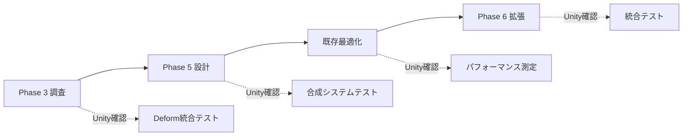
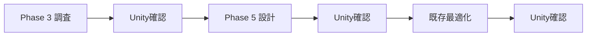

# Vastcore タスク優先度管理表

**最終更新**: 2025年1月  
**管理方針**: 効率的な並行開発のための優先度・緊急度マトリックス管理

---

## 🎯 **アイゼンハワー・マトリックス分類**

### **第1象限：緊急・重要（すぐやる）**

| No. | タスク名 | 工数 | 期限 | 実行者 | 状況 |
|-----|----------|------|------|--------|------|
| 1 | **Phase 3 Deformシステム技術調査** | 2-3R | 即座 | Web | 🔴 最優先 |
| 2 | **CompositionTab修正機能のUnityテスト** | 1R | Unity作業時 | Unity | 🟡 テスト待ち |
| 3 | **RandomControlTab拡張機能のUnityテスト** | 1R | Unity作業時 | Unity | 🟡 テスト待ち |

### **第2象限：重要・非緊急（計画してやる）**

| No. | タスク名 | 工数 | 期限 | 実行者 | 状況 |
|-----|----------|------|------|--------|------|
| 4 | **Phase 5 高度合成システム設計** | 3-4R | 2週間 | Web | ⏳ 準備中 |
| 5 | **既存システム最適化（メモリ・速度）** | 4-5R | 3週間 | Web | ⏳ 準備中 |
| 6 | **Phase 6 ランダム制御拡張** | 3-4R | 4週間 | Web | ⏳ 準備中 |
| 7 | **自動テストスイート構築** | 3-4R | 5週間 | Web | ⏳ 準備中 |

### **第3象限：緊急・非重要（委任する）**

| No. | タスク名 | 工数 | 期限 | 実行者 | 状況 |
|-----|----------|------|------|--------|------|
| 8 | **ドキュメント整理・統合** | 1-2R | 随時 | Web | 📝 継続中 |
| 9 | **APIドキュメント更新** | 1-2R | 随時 | Web | 📝 継続中 |
| 10 | **バグ修正・軽微な改善** | 0.5-1R | 随時 | Web | 🔧 継続中 |

### **第4象限：非緊急・非重要（やらない）**

| No. | タスク名 | 理由 | 判断 |
|-----|----------|------|------|
| 11 | **過度なUI装飾** | 機能開発優先 | ❌ 延期 |
| 12 | **非実用的な実験機能** | 成果物重視 | ❌ 延期 |

---

## 📅 **週次スケジューリング**

### **第1週: Phase 3 基盤構築**
```
【Web作業】
- Day 1-2: Deformパッケージ技術調査
- Day 3-4: 統合方式設計・UI設計
- Day 5: 実装準備・技術文書作成

【Unity作業】（適宜実施）
- CompositionTab/RandomControlTab テスト
- 既存機能の動作確認
```

### **第2週: Phase 5 設計開始**
```
【Web作業】
- Day 1-2: AdvancedCompositionSystem クラス設計
- Day 3-4: LOD・メッシュ最適化アルゴリズム設計
- Day 5: 距離フィールド合成設計

【Unity作業】（適宜実施）
- Phase 3 基本実装テスト
- パフォーマンス測定基準策定
```

### **第3週: 最適化・拡張**
```
【Web作業】
- Day 1-2: 既存システム解析・ボトルネック特定
- Day 3-4: メモリ・CPU最適化実装
- Day 5: Phase 6 ランダム制御拡張設計

【Unity作業】（適宜実施）
- Phase 5 プロトタイプテスト
- 最適化効果検証
```

### **第4週: 統合・テスト**
```
【Web作業】
- Day 1-2: 自動テストスイート実装
- Day 3-4: システム統合・品質保証
- Day 5: 次フェーズ計画策定

【Unity作業】（適宜実施）
- 全機能統合テスト
- パフォーマンス最終検証
```

---

## ⚡ **並行作業フロー**

### **パターン1: 効率重視（推奨）**


### **パターン2: 安定重視**


---

## 📊 **進捗KPI管理**

### **開発速度指標**

| 指標 | 目標値 | 現在値 | 状況 |
|------|--------|--------|------|
| **週次タスク完了率** | 80%以上 | - | 🎯 新規 |
| **コード品質スコア** | 90%以上 | - | 🎯 新規 |
| **Unity確認効率** | 1タスク/1時間 | - | 🎯 新規 |
| **ドキュメント更新率** | 100% | 100% | ✅ 達成 |

### **機能完成度指標**

| フェーズ | 設計完了 | 実装完了 | テスト完了 | 状況 |
|----------|----------|----------|------------|------|
| **Phase 1** | ✅ 100% | ✅ 100% | ✅ 100% | 🟢 完了 |
| **Phase 2** | ✅ 100% | ✅ 100% | ✅ 100% | 🟢 完了 |
| **Phase 3** | ⏳ 0% | ⏳ 0% | ⏳ 0% | 🔴 開始待ち |
| **Phase 4** | ✅ 100% | ✅ 100% | ✅ 100% | 🟢 完了 |
| **Phase 5** | ⏳ 0% | ⏳ 0% | ⏳ 0% | 🔴 開始待ち |
| **Phase 6** | ✅ 80% | ✅ 75% | ⏳ 0% | 🟡 進行中 |

### **品質管理指標**

| 品質項目 | 目標 | 現在 | 改善要 |
|----------|------|------|--------|
| **メモリ効率** | 最適化前比20%改善 | - | 🎯 新規 |
| **処理速度** | 最適化前比30%改善 | - | 🎯 新規 |
| **エラー率** | 1%未満 | - | 🎯 新規 |
| **コード重複** | 5%未満 | - | 🎯 新規 |

---

## 🚨 **リスク管理**

### **技術リスク**

| リスク項目 | 確率 | 影響度 | 対策 | 責任者 |
|------------|------|--------|------|--------|
| **Deformパッケージ互換性** | 中 | 高 | 代替実装準備 | Web開発 |
| **メモリ不足（大規模メッシュ）** | 中 | 中 | 分割処理実装 | Web開発 |
| **ProBuilder API変更** | 低 | 高 | バージョン固定・ラッパー実装 | Web開発 |

### **プロジェクトリスク**

| リスク項目 | 確率 | 影響度 | 対策 | 責任者 |
|------------|------|--------|------|--------|
| **スケジュール遅延** | 中 | 中 | 優先度再調整・スコープ縮小 | 計画管理 |
| **品質低下** | 低 | 高 | 自動テスト・コードレビュー強化 | 品質管理 |
| **技術的債務蓄積** | 中 | 中 | 定期リファクタリング実施 | Web開発 |

---

## 🎯 **成果定義**

### **短期成果（1-2週間）**
- [ ] Phase 3 技術調査完了・実装計画策定
- [ ] Phase 5 基本設計完了
- [ ] 既存システム解析・最適化候補特定

### **中期成果（1ヶ月）**
- [ ] Phase 3 基本実装完了・Unity統合
- [ ] Phase 5 主要機能実装完了
- [ ] 既存システム20%以上パフォーマンス向上

### **長期成果（3ヶ月）**
- [ ] Phase 3,5,6 すべて実装・テスト完了
- [ ] 次世代機能設計開始
- [ ] プロジェクト安定性・品質90%以上達成

---

**次回作業**: Phase 3 Deformシステム技術調査（優先度：🔴最高） 