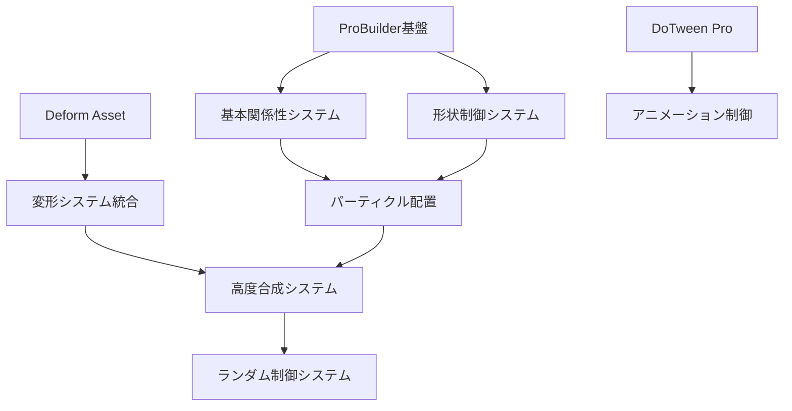

# 【設計仕様書】高度プロシージャル構造物生成システム

**プロジェクト名:** Vastcore - Advanced Procedural Structure Generation System  
**作成日:** 2025年1月  
**バージョン:** 1.0  

---

## 1. システム概要

### 1.1 目的
広大な地形上に配置される巨大遺跡の生成において、以下を実現する：
- **関係性ベースの配置**: 構造物間の論理的な位置関係
- **高度な形状制御**: 直感的パラメータによる複雑な形状生成
- **プロシージャル変形**: Deformシステムとの統合
- **制御されたランダム性**: 予測可能な範囲での多様性生成

### 1.2 技術基盤
- **Unity ProBuilder**: 基本形状生成とBoolean演算
- **Deform Asset**: 高度なメッシュ変形 ([Deform - Unity Asset Store](https://assetstore.unity.com/packages/tools/modeling/deform-148425))
- **DoTween Pro**: アニメーション・補間処理
- **CSG Integration**: pb_CSG による Boolean 演算

---

## 2. 構造物関係性システム

### 2.1 階層的配置制御

```csharp
public enum StructureRelationship
{
    // 基本配置
    OnTop,           // 台の上
    Inside,          // リングの内側
    OnSide,          // 塔の側面
    Around,          // 周囲に配置
    
    // 複合配置
    OrbitAround,     // 軌道配置
    StackedOn,       // 積み重ね
    ConnectedTo,     // 連結
    MirroredFrom,    // 鏡像配置
    
    // 高度な関係性
    FollowPath,      // パス追従
    ClusterAround,   // クラスター配置
    NetworkNode      // ネットワーク結節点
}
```

### 2.2 相対位置制御

```csharp
public struct RelativePosition
{
    public Vector3 offset;           // 基本オフセット
    public Vector3 rotationOffset;   // 回転オフセット
    public Vector3 scaleMultiplier;  // スケール倍率
    public float distance;           // 距離係数
    public float angle;              // 角度
    public AnimationCurve distribution; // 分布カーブ
}
```

---

## 3. 高度形状制御システム

### 3.1 基本パラメータ

#### 3.1.1 形状基本要素
```csharp
public struct ShapeParameters
{
    [Header("基本形状")]
    public float twist;              // ねじれ (0-360度)
    public float length;             // 長さ倍率
    public float thickness;          // 太さ倍率
    public float smoothness;         // 滑らかさ (0-1)
    
    [Header("押し出し制御")]
    public float extrudeRandomness;  // 押し出しランダム分布
    public AnimationCurve extrudeCurve; // 押し出しカーブ
    public int extrudeIterations;    // 押し出し回数
}
```

#### 3.1.2 形状操作
```csharp
public struct ShapeModification
{
    [Header("変形操作")]
    public float topTaper;           // 上部絞り
    public float bottomTaper;        // 下部絞り
    public float waistConstriction;  // くびれ
    public Vector3 bend;             // ベンド方向・強度
    
    [Header("破壊的操作")]
    public float cutPercentage;      // カット割合
    public float fracture;           // 破砕強度
    public float liquefaction;       // 液状化効果
    public bool partialTwist;        // 部分ねじれ
    public Vector2 twistRange;       // ねじれ範囲 (0-1)
}
```

### 3.2 Boolean演算制御

```csharp
public struct BooleanParameters
{
    [Header("内部加工制御")]
    public float edgeInsetDistance;  // 縁からの内側距離
    public float edgeOutsetDistance; // 縁からの外側距離
    public BooleanOperation operation; // Union/Subtract/Intersect
    public float operationStrength;  // 演算強度
    
    [Header("完成形制御")]
    public float completionRatio;    // 完成度 (0-1)
    public AnimationCurve shapeCurve; // 形状制御カーブ
    
    [Header("追加制御機能")]
    public FaceSelectionMode faceMode; // 面選択モード
    public float volumeThreshold;    // 体積閾値
    public bool preserveOriginalUV;  // 元UV保持
    public float blendSharpness;     // ブレンドの鋭さ
    public Vector3 operationCenter;  // 演算中心点
    public float falloffRadius;      // 減衰半径
}

public enum FaceSelectionMode
{
    All,                 // 全面
    TopFaces,            // 上面のみ
    SideFaces,           // 側面のみ
    BottomFaces,         // 下面のみ
    NormalDirection,     // 法線方向指定
    CurvatureBased,      // 曲率ベース
    AreaBased,           // 面積ベース
    RandomSelection,     // ランダム選択
    ConditionalSelection // 条件付き選択
}
```

### 3.3 高度加工システム

```csharp
public struct AdvancedProcessing
{
    [Header("表面加工")]
    public float surfaceRoughness;   // 表面粗さ
    public float detailScale;        // 詳細スケール
    public int noiseOctaves;         // ノイズオクターブ
    public float noiseFrequency;     // ノイズ周波数
    
    [Header("エッジ処理")]
    public float edgeBevel;          // エッジベベル
    public float edgeSharpness;      // エッジ鋭さ
    public bool autoSmooth;          // 自動スムージング
    public float smoothingAngle;     // スムージング角度
    
    [Header("構造的加工")]
    public float hollowThickness;    // 中空化厚さ
    public bool createShell;         // シェル作成
    public float ribThickness;       // リブ厚さ
    public int ribCount;             // リブ数
    
    [Header("風化・劣化")]
    public float weatheringIntensity; // 風化強度
    public WeatheringType weatherType; // 風化タイプ
    public float erosionPattern;     // 侵食パターン
    public float crackDensity;       // ひび割れ密度
}

public enum WeatheringType
{
    None,
    WindErosion,        // 風化
    WaterErosion,       // 水による侵食
    ChemicalWeathering, // 化学的風化
    FrostWeathering,    // 凍結風化
    BiologicalErosion,  // 生物による侵食
    CombinedWeathering  // 複合風化
}
```

---

## 4. Deformシステム統合

### 4.1 対応Deformer一覧

[Deform Asset](https://assetstore.unity.com/packages/tools/modeling/deform-148425) の全機能を統合：

#### 4.1.1 基本変形
```csharp
public enum DeformerType
{
    // 基本変形
    Bend,                // ベンド
    Bulge,               // 膨らみ
    Flare,               // フレア
    Melt,                // 溶解
    Noise,               // ノイズ
    Ripple,              // リップル
    Sine,                // サイン波
    Spherify,            // 球面化
    Squash,              // スカッシュ
    Taper,               // テーパー
    Twist,               // ツイスト
    Wave,                // ウェーブ
    
    // 高度変形
    Curve,               // カーブ変形
    Lattice,             // ラティス
    Magnet,              // マグネット
    Morph,               // モーフ
    Path,                // パス変形
    Turbulence,          // 乱流
    Vortex,              // 渦
    
    // 複合変形
    MultiDeform,         // 複数変形合成
    ConditionalDeform,   // 条件付き変形
    AnimatedDeform       // アニメーション変形
}
```

#### 4.1.2 変形パラメータ制御
```csharp
public struct DeformerParameters
{
    public DeformerType type;
    public float strength;           // 変形強度
    public Vector3 axis;            // 変形軸
    public Vector3 center;          // 変形中心
    public AnimationCurve falloff;  // 減衰カーブ
    public float frequency;         // 周波数（波形系）
    public float amplitude;         // 振幅（波形系）
    public bool useNoise;           // ノイズ使用
    public float noiseScale;        // ノイズスケール
    
    [Header("高度制御")]
    public bool useGradientMask;    // グラデーションマスク使用
    public Gradient maskGradient;   // マスクグラデーション
    public bool invertMask;         // マスク反転
    public float maskOffset;        // マスクオフセット
    public AnimationCurve customFalloff; // カスタム減衰
}
```

---

## 5. パーティクル的配置システム

### 5.1 配置パターン

```csharp
public enum DistributionPattern
{
    // 基本パターン
    Linear,              // 線形配置
    Circular,            // 円形配置
    Grid,                // グリッド配置
    Random,              // ランダム配置
    
    // 高度パターン
    Spiral,              // スパイラル配置
    Fractal,             // フラクタル配置
    Noise,               // ノイズベース配置
    Curve,               // カーブ追従配置
    
    // 物理シミュレーション
    Gravity,             // 重力シミュレーション
    Repulsion,           // 反発力
    Attraction,          // 引力
    FlowField,           // フローフィールド
    
    // 追加パターン
    Voronoi,             // ボロノイ図ベース
    Poisson,             // ポアソンディスク
    Organic,             // 有機的配置
    Architectural        // 建築的配置
}
```

### 5.2 配置制御パラメータ

```csharp
public struct DistributionParameters
{
    [Header("基本配置")]
    public DistributionPattern pattern;
    public int count;                // 配置数
    public float spacing;            // 間隔
    public Vector3 direction;        // 方向ベクトル
    
    [Header("ランダム要素")]
    public float positionRandomness; // 位置ランダム
    public float rotationRandomness; // 回転ランダム
    public float scaleRandomness;    // スケールランダム
    
    [Header("線形効果")]
    public AnimationCurve scaleCurve;     // スケール変化
    public AnimationCurve rotationCurve;  // 回転変化
    public Gradient colorGradient;        // 色変化
    
    [Header("Boolean適用")]
    public bool applyBooleanToArray;      // 配列にBoolean適用
    public BooleanParameters booleanParams;
    
    [Header("高度制御")]
    public bool useTerrainConformity;     // 地形適合
    public float terrainOffset;           // 地形オフセット
    public bool avoidOverlap;             // 重複回避
    public float minDistance;             // 最小距離
    public LayerMask collisionMask;       // コリジョンマスク
}
```

---

## 6. 高度合成システム

### 6.1 モデル合成

```csharp
public struct ModelComposition
{
    [Header("合成制御")]
    public List<GameObject> sourceModels;    // 合成元モデル
    public CompositionMethod method;         // 合成方法
    public float blendRatio;                 // ブレンド比率
    
    [Header("細分化")]
    public int subdivisionLevel;             // 細分化レベル
    public bool adaptiveSubdivision;         // 適応的細分化
    public float curvatureThreshold;         // 曲率閾値
    
    [Header("品質制御")]
    public bool preserveUVs;                 // UV保持
    public bool preserveNormals;             // 法線保持
    public bool optimizeMesh;                // メッシュ最適化
    
    [Header("追加機能")]
    public bool generateLOD;                 // LOD生成
    public int lodLevels;                    // LODレベル数
    public float lodReduction;               // LOD削減率
    public bool bakeLighting;                // ライティング焼き込み
    public bool generateColliders;           // コライダー生成
}
```

### 6.2 合成方法

```csharp
public enum CompositionMethod
{
    Union,               // 結合
    Intersection,        // 交差
    Difference,          // 差分
    Morph,               // モーフィング
    Blend,               // ブレンド
    LayeredBlend,        // 層状ブレンド
    ConditionalBlend,    // 条件付きブレンド
    AnimatedBlend,       // アニメーションブレンド
    
    // 追加合成方法
    VolumetricBlend,     // 体積ブレンド
    SurfaceBlend,        // 表面ブレンド
    DistanceField,       // 距離フィールド合成
    NoiseBlend,          // ノイズブレンド
    MaskBlend,           // マスクブレンド
    GradientBlend        // グラデーションブレンド
}
```

---

## 7. ランダム制御システム

### 7.1 ランダム生成パターン

```csharp
public enum RandomizationMode
{
    PureRandom,          // 純粋ランダム（テスト用）
    ParameterRandom,     // パラメータのみランダム（テスト用）
    ChanceRandom,        // チャンス値による項目ランダム（テスト用）
    ControlledRandom,    // 制御されたランダム（本格運用）
    BlendShapeRandom     // ブレンドシェイプ的ランダム
}
```

### 7.2 制御されたランダム性

```csharp
public struct ControlledRandomization
{
    [Header("基本制御")]
    public RandomizationMode mode;
    public int seed;                     // ランダムシード
    public float globalIntensity;        // 全体強度
    
    [Header("項目別制御")]
    public List<RandomParameter> parameters;
    
    [Header("制約")]
    public float maxTotalVariation;      // 最大総変化量
    public float antiExtremeThreshold;   // 極端値回避閾値
    public float sizeLimit;              // サイズ制限
    
    [Header("ブレンド制御")]
    public bool useBlendShapeLogic;      // ブレンドシェイプ論理使用
    public float blendWeight;            // ブレンド重み
    public AnimationCurve blendCurve;    // ブレンドカーブ
}
```

### 7.3 個別パラメータ制御

```csharp
[System.Serializable]
public struct RandomParameter
{
    public string parameterName;         // パラメータ名
    public float minValue;               // 最小値
    public float maxValue;               // 最大値
    public float chanceWeight;           // チャンス重み
    public AnimationCurve distribution;  // 分布カーブ
    public bool canBeNegative;           // 負値許可
    public float extremeAvoidance;       // 極端値回避
}
```

---

## 8. 実装計画

### 8.1 実装フェーズ

#### Phase 1: 基本関係性システム（応答回数: 3-5回）
- 構造物間の基本的な位置関係実装
- OnTop, Inside, OnSide の基本パターン
- 相対位置制御の基礎実装

#### Phase 2: 形状制御システム（応答回数: 5-7回）
- 基本パラメータ（ねじれ、長さ、太さ等）の実装
- Boolean演算の高度制御
- 形状操作（絞り、くびれ、ベンド等）の実装

#### Phase 3: Deformシステム統合（応答回数: 7-10回）
- Deform Assetの統合
- 全変形タイプの対応
- パラメータ制御システムの実装

#### Phase 4: パーティクル的配置（応答回数: 4-6回）
- 配置パターンの実装
- 線形効果とランダム要素
- Boolean演算の配列適用

#### Phase 5: 高度合成システム（応答回数: 6-8回）
- モデル合成機能
- 細分化システム
- 品質制御機能

#### Phase 6: ランダム制御システム（応答回数: 5-7回）
- 制御されたランダム性の実装
- ブレンドシェイプ的ランダム
- 制約システムの実装

### 8.2 技術的依存関係



---

## 9. 技術仕様

### 9.1 パフォーマンス目標
- **生成時間**: 複雑な構造物で10秒以内
- **メモリ使用量**: 構造物あたり50MB以下
- **リアルタイム編集**: パラメータ変更時1秒以内の反映

### 9.2 品質基準
- **メッシュ品質**: 非多様体メッシュの回避
- **UV保持**: テクスチャ適用可能な状態維持
- **法線計算**: 適切な陰影表現
- **コリジョン**: 物理演算対応

### 9.3 拡張性
- **プラグイン対応**: 新しい変形タイプの追加可能
- **スクリプト拡張**: カスタムパラメータの追加可能
- **アセット統合**: 外部3Dモデルの組み込み可能

---

## 10. 参考資料

- [Deform - Unity Asset Store](https://assetstore.unity.com/packages/tools/modeling/deform-148425)
- [Mesh and Object Deformers - Unity Asset Store](https://assetstore.unity.com/packages/tools/modeling/mesh-and-object-deformers-for-unity-3d-81427)
- Unity ProBuilder Documentation
- DoTween Pro Documentation

---

**文書管理**
- 最終更新: 2025年1月
- 次回レビュー: Phase 1完了後
- 承認者: プロジェクト責任者 