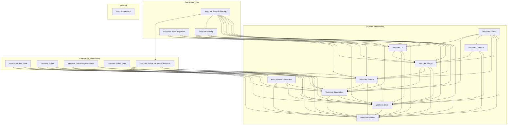

# VastCore Assembly Architecture (SSOT)

本ドキュメントは VastCore の Unity Assembly Definition (asmdef) 依存グラフと名前空間規約の**唯一の正 (SSOT)** である。
asmdef の追加・変更・参照修正を行う場合、必ず本ドキュメントを先に更新し、実装をそれに合わせること。

最終更新: 2026-02-18

---

## 1. 依存グラフ (DAG)



## 2. アセンブリ一覧

### 2.1 Runtime (ランタイム)

| Assembly | Directory | rootNamespace | autoReferenced | 依存先 |
|----------|-----------|---------------|----------------|--------|
| `Vastcore.Utilities` | `Assets/Scripts/Utilities/` | `Vastcore.Utilities` | false | *(none)* |
| `Vastcore.Core` | `Assets/Scripts/Core/` | `Vastcore.Core` | false | Utilities |
| `Vastcore.Generation` | `Assets/Scripts/Generation/` | `Vastcore.Generation` | **true** | Core, Utilities |
| `Vastcore.MapGenerator` | `Assets/MapGenerator/Scripts/` | `Vastcore.Generation` | **true** | Generation, Core, Utilities |
| `Vastcore.Terrain` | `Assets/Scripts/Terrain/` | `Vastcore.Terrain` | false | Core, Utilities, Generation |
| `Vastcore.Player` | `Assets/Scripts/Player/` | `Vastcore.Player` | false | Core, Utilities, Terrain, Generation |
| `Vastcore.Camera` | `Assets/Scripts/Camera/` | `Vastcore.Camera` | false | Core, Utilities, Player |
| `Vastcore.UI` | `Assets/Scripts/UI/` | `Vastcore.UI` | false | Core, Utilities, Player |
| `Vastcore.Game` | `Assets/Scripts/Game/` | `Vastcore.Game` | false | Core, Utilities, Player, Terrain, Camera, Generation, UI |

### 2.2 Editor-Only (エディタ専用)

| Assembly | Directory | rootNamespace | 依存先 |
|----------|-----------|---------------|--------|
| `Vastcore.Editor.Root` | `Assets/Editor/` | `Vastcore.Editor` | Core, Generation, Terrain, Utilities |
| `Vastcore.Editor` | `Assets/Scripts/Editor/` | `Vastcore.Editor` | Core, Utilities, Generation, Terrain, MapGenerator |
| `Vastcore.Editor.MapGenerator` | `Assets/MapGenerator/Scripts/Editor/` | `Vastcore.Editor.MapGenerator` | Generation, MapGenerator, Utilities, Core |
| `Vastcore.Editor.Tools` | `Assets/Editor/Tools/` | `Vastcore.EditorTools` | *(none)* |
| `Vastcore.Editor.StructureGenerator` | `Assets/Editor/StructureGenerator/` | `Vastcore.Editor.StructureGenerator` | Terrain, Core, Utilities, Generation |

### 2.3 Test / Legacy

| Assembly | Directory | rootNamespace |
|----------|-----------|---------------|
| `Vastcore.Testing` | `Assets/Scripts/Testing/` | `Vastcore.Testing` |
| `Vastcore.Tests.EditMode` | `Assets/Tests/EditMode/` | `Vastcore.Tests.EditMode` |
| `Vastcore.Tests.PlayMode` | `Assets/Tests/PlayMode/` | `Vastcore.Tests.PlayMode` |
| `Vastcore.Legacy` | `Assets/_Scripts/` | *(empty)* |

---

## 3. 絶対ルール

### R1: 循環参照禁止
依存グラフは必ず DAG (有向非循環グラフ) を維持する。追加する参照が既存の逆方向パスを作らないか、上記グラフで確認すること。

### R2: レイヤー方向の遵守
```
Utilities → Core → Generation → Terrain / Player → Camera / UI → Game
                 ↗ MapGenerator ↗
```
**下位 → 上位** への参照は禁止。上位 → 下位のみ許可。

### R3: 名前空間とアセンブリの 1:1 対応
- 各 asmdef の `rootNamespace` に一致する名前空間のみ使用する。
- **例外**: `Vastcore.MapGenerator` は歴史的に `rootNamespace: Vastcore.Generation` を使用。MapGenerator 内のスクリプトは `Vastcore.Generation` 名前空間を使ってよい。

### R4: 同名型の重複定義禁止
同じ完全修飾名 (namespace + class name) を複数のアセンブリに定義してはならない。
ビルド時に CS0029 (型変換不可) や CS0433 (型の競合) を引き起こす。

### R5: interface を `FindFirstObjectByType<T>()` に渡さない
Unity の generic 制約 `T : UnityEngine.Object` を満たさない interface 型は使用不可。
代わりに `GameObject.FindGameObjectWithTag()` + `GetComponent<T>()` パターンを使う。

### R6: autoReferenced の管理
- `autoReferenced: true` にできるのは**他の名前付きアセンブリから参照されないアセンブリのみ**。
- 現在 `true` が許可されているのは: `Vastcore.Generation`, `Vastcore.MapGenerator`。
- `autoReferenced` の変更は本ドキュメントの更新を必須とする。

### R7: C# 言語バージョンの制約
プロジェクトの C# バージョンは Unity が決定する (現在 C# 9.0)。
C# 10 以降の機能 (引数なし struct コンストラクタ、global using 等) は使用禁止。

### R8: 条件コンパイルシンボルの隔離
`DEFORM_AVAILABLE` 等のオプショナルパッケージに依存するコードは、必ず `#if` ～ `#endif` で**完全に**囲む。`#if` の外側にシンボル参照が漏れてはならない。

---

## 4. 新規アセンブリ追加手順

1. 本ドキュメントの「依存グラフ」と「アセンブリ一覧」に追加先を記載する
2. 循環参照が発生しないことを DAG 上で確認する
3. asmdef ファイルを作成する
4. 参照元の asmdef に参照を追加する
5. Unity Editor で Reimport → コンパイル成功を確認する
6. 本ドキュメントの Mermaid 図を更新する

## 5. 型の配置ルール

| 型の用途 | 配置先アセンブリ | 例 |
|----------|----------------|-----|
| ロガー、共通ユーティリティ | `Vastcore.Utilities` | `VastcoreLogger` |
| インターフェース、基底クラス | `Vastcore.Core` | `IPlayerController`, `TerrainSynthesizer` |
| 地形生成データ型、enum | `Vastcore.Generation` | `BiomeType`, `HeightMapChannel`, `BiomePreset` |
| 地形ランタイムシステム | `Vastcore.Terrain` | `IntelligentCacheSystem`, `PlayerTrackingSystem` |
| プレイヤーシステム | `Vastcore.Player` | `PlayerController` |
| UI システム | `Vastcore.UI` | `UIRealtimeManager`, `RealtimeUIBehaviour` |
| レガシー MapGenerator | `Vastcore.MapGenerator` | `TerrainGenerator`, `HeightMapGenerator` |
