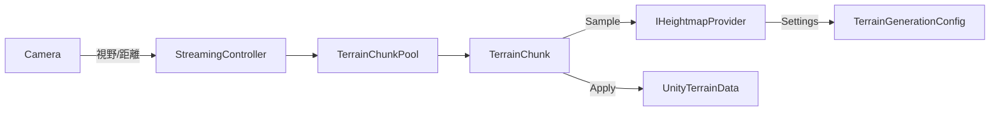

# Terrain Engine Design (Phase 3 / M1)

## 目的

- シード駆動の再現性ある地形生成。
- 高さデータ供給源を抽象化し、ノイズ/テクスチャ/ハイブリッドを差し替え可能にする。
- M1ではノイズベースを実装。将来M4/M5以降でテクスチャ/ハイブリッドを容易に拡張。

## アーキテクチャ概要

- 名前空間: `Vastcore.Terrain`
- コンポーネント:
  - `IHeightmapProvider`: 高さデータ供給源の抽象。
  - `NoiseHeightmapProvider`: ノイズによる高さ生成（M1）。
  - `TerrainGenerationConfig` (`ScriptableObject`): プロバイダ設定/解像度/ワールドサイズ。
  - `TerrainChunk`: プロバイダから高さグリッドを取得し、`Unity Terrain` を生成。

## 高さデータ供給の抽象化

- インターフェース:
  - `Generate(float[] heights, int resolution, Vector2 worldOrigin, float worldSize, HeightmapGenerationContext ctx)`
  - 出力は正規化[0,1]。座標は `worldOrigin`/`worldSize` に基づくワールド一貫系。
- 実装の例:
  - `NoiseHeightmapProvider`（M1）
  - `TextureHeightmapProvider`（将来）
  - `HybridHeightmapProvider`（将来）
- 設定は `ScriptableObject` ベースの多態で保持し、Factoryで `IHeightmapProvider` を供給。

## M1 範囲（DoD）

- 3×3 チャンクをノイズで生成し、例外無しで描画。
- 同一seed/座標で再現性を確認。隣接チャンクの境界シーム差分は閾値以下。
- PlayMode テスト（Provider差し替え/範囲/再現性/シーム）を追加しグリーン。

## テスト観点

- 再現性: 同seedで同一出力。
- パラメータ: scale/octaves/gain/lacunarity/offset の影響が制御可能。
- シーム: 隣接チャンクの共有エッジが一致。

## 将来拡張（抜粋）

- `TextureHeightmapProvider`: Texture2Dから高さをサンプル（UV→[0,1]）。
- `HybridHeightmapProvider`: テクスチャ基盤+ノイズディテールの合成。
- Jobs/Burst/Compute: 生成の並列化/高速化（M8）。

## M2: World Streaming（チャンク生成/破棄）

### スコープ

- カメラ（または任意ターゲット）位置を中心に、リング半径 `loadRadius` 内のチャンクを自動生成。
- 範囲外のチャンクはプールへ返却し再利用。生成スパイクを抑制。
- `TerrainGenerationConfig` + `IHeightmapProvider` を継続利用し、差し替え可能な高さソースを維持。

### 主要コンポーネント

- `TerrainChunkPool`
  - `Stack<TerrainChunk>` によるシンプルなプール。
  - `Get(origin)` でアクティブ化＆再ビルド、`Release(chunk)` で非アクティブ化。
  - 将来の非同期生成やバッチ生成へ拡張可能。
- `TerrainStreamingController`
  - フォーカスターゲット（デフォルト `Camera.main`）を追跡し、ワールド座標→チャンク座標へ変換。
  - `UpdateStreaming(position)` で必要チャンク集合を算出し、差分ロード/アンロード。
  - `ActiveChunkCoords`（読み取り専用）と `CurrentCenter` を公開（テスト・可視化用）。
  - `loadRadius`, `worldOrigin`, `updateThreshold`, `maxLoadPerFrame` 等を設定可能。

### 実装方針

- チャンク座標: `Vector2Int(cx, cz)`、ワールド原点とチャンクサイズ(`worldSize`)から `origin = worldOrigin + (cx * worldSize, cz * worldSize)` を算出。
- 更新頻度: ターゲットの移動距離が `updateThreshold` を越えた際にのみ差分計算。
- 破棄タイミング: 必要集合から外れたチャンクは即座に `Release()` し、プールへ格納。
- 拡張余地: `maxLoadPerFrame` で生成件数を制限しスパイクを抑制（M2では閾値小・必要なら次フェーズで最適化）。

### DoD（完了条件）

- 半径 `loadRadius` に応じた `(2r+1)^2` 枚のチャンクが常にアクティブ。
- ターゲット移動で新たなチャンクが生成され、遠方チャンクはプールへ戻る。
- `TerrainChunkPool` による再利用が確認でき、GC/生成スパイクが抑制される（ログまたはプロファイラでヒッチ<20ms 目標）。
- PlayMode テスト（`TerrainStreamingTests`）が再現性とシームレス性を担保。

### テスト計画

- **StreamingLoadsInitialRadius**: 初回 `UpdateStreaming` 後に `(2r+1)^2` チャンクが生成されること。
- **StreamingReactsToMovement**: チャンク1枚分以上移動した際、中心座標が更新され、古いチャンクがアンロードされること。
- **PoolReusesChunks**: チャンクをアンロード後に再び必要になった際、プールが再利用される（生成回数が増えない）。

PlayMode テストでは `HeightmapProviderSettings` をテスト用に派生させ、一定高さを返すプロバイダで挙動を検証する。
