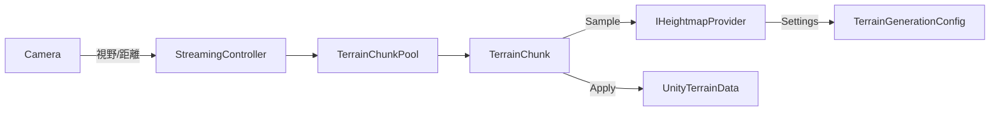

# Terrain Engine Design (Phase 3 / M1)

## 目的

- シード駆動の再現性ある地形生成。
- 高さデータ供給源を抽象化し、ノイズ/テクスチャ/ハイブリッドを差し替え可能にする。
- M1ではノイズベースを実装。将来M4/M5以降でテクスチャ/ハイブリッドを容易に拡張。

## アーキテクチャ概要

- 名前空間: `Vastcore.Terrain`
- コンポーネント:
  - `IHeightmapProvider`: 高さデータ供給源の抽象。
  - `NoiseHeightmapProvider`: ノイズによる高さ生成（M1）。
  - `TerrainGenerationConfig` (`ScriptableObject`): プロバイダ設定/解像度/ワールドサイズ。
  - `TerrainChunk`: プロバイダから高さグリッドを取得し、`Unity Terrain` を生成。

## 高さデータ供給の抽象化

- インターフェース:
  - `Generate(float[] heights, int resolution, Vector2 worldOrigin, float worldSize, HeightmapGenerationContext ctx)`
  - 出力は正規化[0,1]。座標は `worldOrigin`/`worldSize` に基づくワールド一貫系。
- 実装の例:
  - `NoiseHeightmapProvider`（M1）
  - `TextureHeightmapProvider`（将来）
  - `HybridHeightmapProvider`（将来）
- 設定は `ScriptableObject` ベースの多態で保持し、Factoryで `IHeightmapProvider` を供給。

## M1 範囲（DoD）

- 3×3 チャンクをノイズで生成し、例外無しで描画。
- 同一seed/座標で再現性を確認。隣接チャンクの境界シーム差分は閾値以下。
- PlayMode テスト（Provider差し替え/範囲/再現性/シーム）を追加しグリーン。

## テスト観点

- 再現性: 同seedで同一出力。
- パラメータ: scale/octaves/gain/lacunarity/offset の影響が制御可能。
- シーム: 隣接チャンクの共有エッジが一致。

## 将来拡張（抜粋）

- `TextureHeightmapProvider`: Texture2Dから高さをサンプル（UV→[0,1]）。
- `HybridHeightmapProvider`: テクスチャ基盤+ノイズディテールの合成。
- Jobs/Burst/Compute: 生成の並列化/高速化（M8）。
