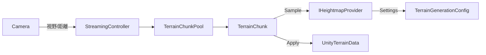

# Terrain Engine Design (Phase 3 / M1-M2)

**Last Updated:** 2026-03-16

## 目的

- シード駆動の再現性ある地形生成。
- 高さデータ供給源を抽象化し、ノイズ/テクスチャ/ハイブリッドを差し替え可能にする。
- M1ではノイズベースを実装。将来M4/M5以降でテクスチャ/ハイブリッドを容易に拡張。

## 正式アーキテクチャにおける位置づけ (2026-03-06 決定)

本システム (HeightMap + Streaming) は、DualGrid + Prefabスタンプアーキテクチャにおける **高さ供給源** として機能する。

```text
IHeightmapProvider (本spec)
  ↓ 高さデータ供給
VerticalExtrusionGenerator (SP-001)
  ↓ ColumnStack 生成
StampRegistry + PrefabStampPlacer (SP-014)
  ↓ Prefab 配置
Scene (GameObjects)
```

- **HeightMap系**: 大域的な地形の起伏を定義 (NoiseHeightmapProvider / 将来TextureProvider)
- **DualGrid系**: Hexベースの不規則グリッドでセルトポロジーを管理
- **Prefabスタンプ系**: デザイナーPrefabをセルに配置

## アーキテクチャ概要

- 名前空間: `Vastcore.Terrain`
- コンポーネント:
  - `IHeightmapProvider`: 高さデータ供給源の抽象。
  - `NoiseHeightmapProvider`: ノイズによる高さ生成（M1）。
  - `TerrainGenerationConfig` (`ScriptableObject`): プロバイダ設定/解像度/ワールドサイズ。
  - `TerrainChunk`: プロバイダから高さグリッドを取得し、`Unity Terrain` を生成。


```mermaid
flowchart LR
  Camera -->|視野/距離| StreamingController
  StreamingController --> TerrainChunkPool
  TerrainChunkPool --> TerrainChunk
  TerrainChunk -->|Sample| IHeightmapProvider
  IHeightmapProvider -->|Settings| TerrainGenerationConfig
  TerrainChunk -->|Apply| UnityTerrainData
```

## 高さデータ供給の抽象化

- インターフェース:
  - `Generate(float[] heights, int resolution, Vector2 worldOrigin, float worldSize, HeightmapGenerationContext ctx)`
  - 出力は正規化[0,1]。座標は `worldOrigin`/`worldSize` に基づくワールド一貫系。
- 実装の例:
  - `NoiseHeightmapProvider`（M1）
  - `TextureHeightmapProvider`（将来）
  - `HybridHeightmapProvider`（将来）
- 設定は `ScriptableObject` ベースの多態で保持し、Factoryで `IHeightmapProvider` を供給。

## M1 範囲（DoD） — 実装済み

- [x] 3×3 チャンクをノイズで生成し、例外無しで描画
- [x] 同一seed/座標で再現性を確認
- [ ] 隣接チャンクの境界シーム差分は閾値以下 (未検証)
- [ ] PlayMode テスト (0件 — Phase D以降)
- **注意**: `HeightmapGenerationContext` は未実装。IHeightmapProvider.Generate の ctx パラメータは現行コードで null または省略されている可能性あり

## テスト観点

- 再現性: 同seedで同一出力。
- パラメータ: scale/octaves/gain/lacunarity/offset の影響が制御可能。
- シーム: 隣接チャンクの共有エッジが一致。

## 将来拡張（抜粋）

- `TextureHeightmapProvider`: Texture2Dから高さをサンプル（UV→[0,1]）。
- `HybridHeightmapProvider`: テクスチャ基盤+ノイズディテールの合成。
- Jobs/Burst/Compute: 生成の並列化/高速化（M8）。

## M2: World Streaming（チャンク生成/破棄）

### スコープ

- カメラ（または任意ターゲット）位置を中心に、リング半径 `loadRadius` 内のチャンクを自動生成。
- 範囲外のチャンクはプールへ返却し再利用。生成スパイクを抑制。
- `TerrainGenerationConfig` + `IHeightmapProvider` を継続利用し、差し替え可能な高さソースを維持。

### 主要コンポーネント

- `TerrainChunkPool`
  - `Stack<TerrainChunk>` によるシンプルなプール。
  - `Get(origin)` でアクティブ化＆再ビルド、`Release(chunk)` で非アクティブ化。
  - 将来の非同期生成やバッチ生成へ拡張可能。
- `TerrainStreamingController`
  - フォーカスターゲット（デフォルト `Camera.main`）を追跡し、ワールド座標→チャンク座標へ変換。
  - `UpdateStreaming(position)` で必要チャンク集合を算出し、差分ロード/アンロード。
  - `ActiveChunkCoords`（読み取り専用）と `CurrentCenter` を公開（テスト・可視化用）。
  - `loadRadius`, `worldOrigin`, `updateThreshold`, `maxLoadPerFrame` 等を設定可能。

### 実装方針

- チャンク座標: `Vector2Int(cx, cz)`、ワールド原点とチャンクサイズ(`worldSize`)から `origin = worldOrigin + (cx * worldSize, cz * worldSize)` を算出。
- 更新頻度: ターゲットの移動距離が `updateThreshold` を越えた際にのみ差分計算。
- 破棄タイミング: 必要集合から外れたチャンクは即座に `Release()` し、プールへ格納。
- 拡張余地: `maxLoadPerFrame` で生成件数を制限しスパイクを抑制（M2では閾値小・必要なら次フェーズで最適化）。

### DoD（完了条件） — コア実装済み、PlayModeテスト未実施

- [x] 半径 `loadRadius` に応じたチャンクがアクティブ (実装済み)
- [x] ターゲット移動で新チャンク生成、遠方チャンクはプール返却 (実装済み)
- [x] `TerrainChunkPool` による再利用 (EditModeテスト存在)
- [ ] GC/生成スパイク抑制の確認 (プロファイラ検証未実施)
- [ ] PlayMode テスト (`TerrainStreamingTests`) — 0件 (Phase D以降)

### テスト計画

- **StreamingLoadsInitialRadius**: 初回 `UpdateStreaming` 後に `(2r+1)^2` チャンクが生成されること。
- **StreamingReactsToMovement**: チャンク1枚分以上移動した際、中心座標が更新され、古いチャンクがアンロードされること。
- **PoolReusesChunks**: チャンクをアンロード後に再び必要になった際、プールが再利用される（生成回数が増えない）。

PlayMode テストでは `HeightmapProviderSettings` をテスト用に派生させ、一定高さを返すプロバイダで挙動を検証する。

---

## 実装状態サマリ (2026-03-16)

| コンポーネント | ファイル | 状態 |
|---------------|----------|------|
| IHeightmapProvider | Terrain/Providers/IHeightmapProvider.cs | 実装済み |
| NoiseHeightmapProvider | Terrain/Providers/NoiseHeightmapProvider.cs | 実装済み |
| TerrainGenerationConfig | Terrain/Config/TerrainGenerationConfig.cs | 実装済み |
| TerrainChunk | Terrain/TerrainChunk.cs | 実装済み |
| TerrainChunkPool | Terrain/TerrainChunkPool.cs | 実装済み (EditModeテストあり) |
| TerrainStreamingController | Terrain/TerrainStreamingController.cs | 実装済み |
| HeightmapGenerationContext | — | 未実装 |
| TextureHeightmapProvider | — | 未実装 (将来) |
| HybridHeightmapProvider | — | 未実装 (将来) |

### DualGrid との統合パス

- `VerticalExtrusionGenerator.GenerateFromHeightMap(Texture2D)` で既存 HeightMap → DualGrid ColumnStack への橋渡しが可能
- `DualGridHeightSamplingSettings` (Generation/) が UV wrapping / quantization を制御
- 現時点では IHeightmapProvider と VerticalExtrusionGenerator の直接接続は未実装。手動で HeightMap 結果を渡す形
