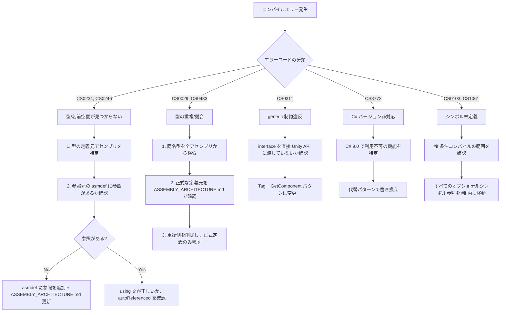

# Compilation Guard Protocol

本ドキュメントは、Unity コンパイルエラーの**予防**と**発生時の体系的診断**手順を定める。
「エラーが出た → とりあえず直す → 新しいエラー → また直す」の泥沼ループを断ち切るためのプロトコルである。

最終更新: 2026-02-18

---

## 1. 予防 (実装前)

### 1.1 事前チェック (Pre-flight)

コード変更を開始する**前に**確認する:

```
1. 変更対象ファイルがどのアセンブリに属するか特定する
2. そのアセンブリの参照先を ASSEMBLY_ARCHITECTURE.md で確認する
3. 追加する using / 参照する型がその参照先に含まれるか確認する
4. 同名の型が他のアセンブリに存在しないか検索する
```

### 1.2 禁止パターン一覧

| パターン | 症状 | 予防策 |
|---------|------|--------|
| 別アセンブリに同名型を定義 | CS0029, CS0433 | 型追加前に `rg "class TypeName"` で検索 |
| interface を FindFirstObjectByType に渡す | CS0311 | Tag + GetComponent パターンを使用 |
| asmdef にない参照先の using | CS0234, CS0246 | using 追加前に asmdef の references を確認 |
| C# 10 以降の機能使用 | CS8773 等 | struct コンストラクタ等は使わない |
| #if の外にオプショナルシンボル | CS0103, CS1061 | コード全体を #if で囲む |
| autoReferenced:false のアセンブリの型を Assembly-CSharp から使用 | CS0246 | autoReferenced を確認、または asmdef を作成 |
| 下位から上位への参照追加 | 循環参照 | DAG を事前確認 |

---

## 2. 検証 (実装後)

### 2.1 最小検証 (必須)

実装完了後、以下の順序で検証する:

```
Step 1: using の検証
  - 追加した using 文ごとに、対象アセンブリの asmdef references を確認

Step 2: 型の一意性検証
  - 追加・移動した型について、同名型がないか検索
  rg "class TypeName\b" Assets/ --glob "*.cs"

Step 3: 条件コンパイルの検証
  - #if で囲まれたブロック外にオプショナルシンボルがないか確認

Step 4: Unity コンパイル
  - Unity Editor で Reimport All または batchmode で確認
```

### 2.2 エラー発生時の診断フロー

エラーが発生した場合、**場当たり修正を禁止**し、以下のフローに従う:



### 2.3 エラー修正の原則

1. **1 エラーにつき 1 原因を特定してから修正する。** 原因不明のまま修正しない。
2. **修正後は全エラーが消えたことを確認してから次の作業に移る。** 新規エラーが出た場合、それも同じ診断フローで処理する。
3. **asmdef の変更は ASSEMBLY_ARCHITECTURE.md を同時に更新する。**
4. **「以前動いていたから戻す」は正当な修正ではない。** なぜ壊れたかを理解してから修正する。

---

## 3. Orchestrator / Worker の責務分担

### Orchestrator の責務
- タスクチケットに **Focus Area に含まれるアセンブリ名** を明記する
- Worker への依頼時に ASSEMBLY_ARCHITECTURE.md を参照先として指定する
- Worker のレポートに「コンパイル確認済み」が含まれていない場合、DONE にしない

### Worker の責務
- 実装前に ASSEMBLY_ARCHITECTURE.md を読み、変更対象アセンブリの依存関係を把握する
- コード変更後に「2.1 最小検証」を実施する
- エラーが出た場合「2.2 診断フロー」に従い、レポートに原因と対応を記録する
- レポートに「Unity Editor コンパイル成功」を必ず記載する

---

## 4. よくある失敗パターンと対策

### 4.1 「using を追加したらコンパイル通らない」
**原因**: 参照先のアセンブリが asmdef の references に含まれていない。
**対策**: using を追加する前に、現在のアセンブリの asmdef を開き、参照先を確認する。

### 4.2 「型を移動したら別の場所でエラーが出た」
**原因**: 移動元と移動先でアセンブリが異なり、参照が切れた。
**対策**: 型を移動する前に、その型を参照しているすべてのアセンブリを `rg` で洗い出す。

### 4.3 「同じ名前のクラスを別ファイルに作ったら CS0029」
**原因**: 同名型が別アセンブリに存在し、ビルド時に別の型として扱われる。
**対策**: 型を追加する前に `rg "class TypeName\b"` で重複チェックする。

### 4.4 「#if DEFORM_AVAILABLE の外でエラーが出る」
**原因**: #if ブロックの外にオプショナルパッケージのシンボルが残っている。
**対策**: #if の開始行から #endif の終了行まで、囲まれた範囲にすべてのシンボル参照が収まっているか目視確認する。

### 4.5 「autoReferenced を変えたら Assembly-CSharp 側でエラーが出た」
**原因**: Assembly-CSharp から暗黙参照されていたアセンブリの autoReferenced を false にした。
**対策**: autoReferenced を変更する前に、Assembly-CSharp に属するスクリプトがそのアセンブリの型を使っていないか確認する。
