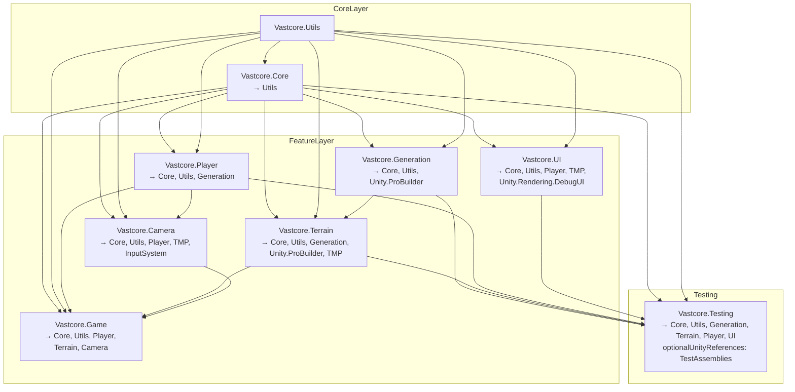

# Vastcore Assembly Design

本ドキュメントは、Vastcore プロジェクト内の Assembly Definition (.asmdef) の依存関係設計を示します。

## 依存関係図（Mermaid）

## 設計方針
- Core/Utils をボトムレイヤーに固定し、上位モジュールからのみ参照（DIP）。
- Generation/Terrain/Player/Camera/UI は機能領域ごとに分割（SRP, SoC）。
- Game はエントリポイントの統合層として各機能を参照。
- Testing は実行時テスト専用。`optionalUnityReferences: ["TestAssemblies"]` を付与済み。

## メモ
- Deform（外部パッケージ）統合時は、各 asmdef に対し defineConstraints と可用性を調整し、`DEFORM_AVAILABLE` を正しく尊重する。
- URP/TMP/InputSystem/DebugUI などの Unity パッケージは、利用箇所のみに限定。
