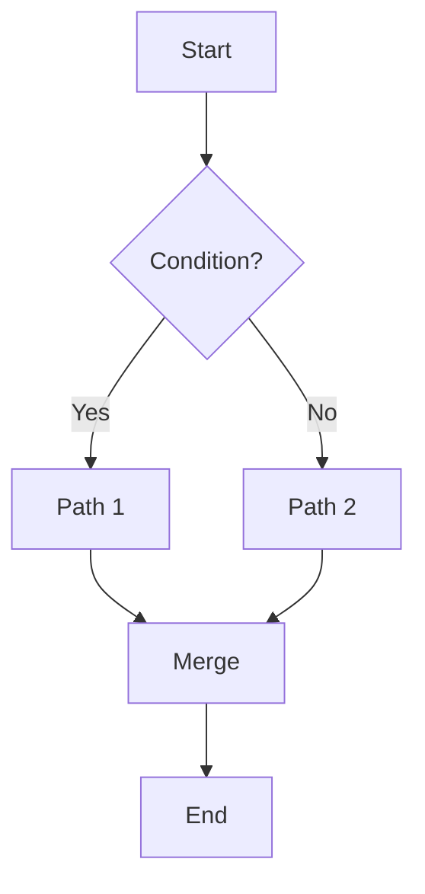

# Mermaid 分岐サンプル

以下は flowchart で分岐を表現する最小例です。`tools/mermaid/mermaid-preview.html` に貼り付けて、IDs に `B,C` を指定すると該当ノードがハイライトされます。

## Tips
- ノードIDは角括弧やテキストとは別に、左辺の識別子（`A`, `B`, `C` など）です。
- 複数ハイライトする場合はカンマ区切りで指定してください（例: `A,E,F`）。
