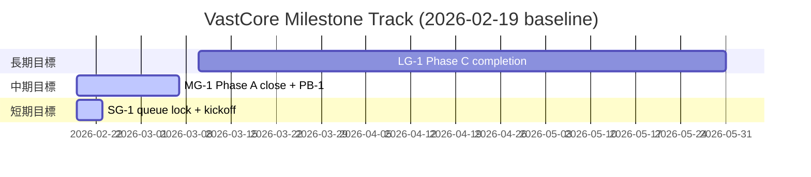

# Milestone Plan

## 基本情報

- **最終更新**: 2026-02-20T15:58:44+09:00
- **更新者**: Orchestrator (Codex)

---

## 長期目標（Someday / 月次〜四半期）

### LG-1: Phase C 機能完成（Deform正式統合 + CSG検証）

- **ゴール**: Deform パッケージ正式統合と StructureGenerator の主要未完了機能を完了し、Phase C の完了基準を満たす。
- **期限目安**: 2026-05
- **状態**: 未着手
- **進捗**: 0%
- **関連マイルストーン**: MG-1, MG-2

---

## 中期目標（Later / 1〜2週間）

### MG-1: Phase A 完了と品質基盤の着手

- **ゴール**: Phase A の残件（PA-2, PA-5）を完了し、PB-1（NUnit基盤）を開始できる状態にする。
- **期限目安**: 2026-03-07
- **状態**: 進行中（後半）
- **進捗**: 78%
- **含まれるタスク**: TASK_PA-2_ProBuilderApiMigration.md, TASK_PA-5_UnityCompileVerification.md, TASK_035_AutoCompileValidationAutomation.md, TASK_PB-1_NUnitTestFoundation.md
- **完了基準**:
  - [x] PA-2 が DONE（Subdivide 系 TODO 解消）
  - [x] PA-5 で `Unity Editor=コンパイル成功` を記録
  - [x] TASK_035 の自動コンパイル検証スクリプトが運用化
  - [ ] PB-1 が IN_PROGRESS 以上で開始される
  - [ ] テスト全通過・ビルド成功

---

## 短期目標（Next / 今日〜数日）

### SG-1: 直近実行キューの確定と着手

- **ゴール**: 実行可能タスクを確定し、Worker に渡せる着手順を固定する。
- **対象タスク**: TASK_PA-2_ProBuilderApiMigration.md, TASK_035_AutoCompileValidationAutomation.md, TASK_PA-5_UnityCompileVerification.md
- **完了基準**:
  - [x] PA-2 の実行と完了
  - [x] TASK_035 の実行と完了
  - [x] PA-5 のブロック解除と完了

### SG-2: Phase B キックオフの着手固定

- **ゴール**: PB-1 を開始し、Vertical Slice 側の残タスクを完了順に固定する。
- **対象タスク**: TASK_PB-1_NUnitTestFoundation.md, TASK_036_DualGridInspectorProfilePreview.md, TASK_037_TerrainVerticalSlice_CloseoutSummary.md
- **完了基準**:
  - [ ] PB-1 が IN_PROGRESS 以上になる
  - [ ] TASK_036 の優先度判断（先行/後続）を確定
  - [ ] TASK_037 の完了で Vertical Slice の handover を単一文書化

---

## 現在地マップ

---

## 振り返りログ（KPT）

### 2026-02-19: Phase A/PB 接続点の再整理（起票）

**Keep（続けること）**:

- asmdef 境界とコンパイル証跡を DoD に含める運用

**Problem（課題）**:

- PA-2 / PA-5 が未起票で、短期実行順が固定されていなかった

**Try（次に試すこと）**:

- SG-1 の順で Worker 実行（PA-2 → TASK_035 → PA-5）

**優先度変更**:

- PA-2 を短期最優先へ引き上げ（PA-5 の前提）

---

## 履歴

- 2026-02-19 13:30: MILESTONE_PLAN.md を初期化（SG/MG/LG を定義）
- 2026-02-20 15:58: PA-2 / TASK_035 / PA-5 完了を反映、SG-2 を追加
