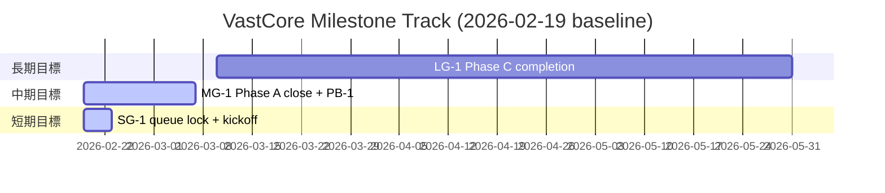

# Milestone Plan

## 基本情報

- **最終更新**: 2026-03-16
- **更新者**: Claude Code (Opus 4.6)

---

## 長期目標（Someday / 月次〜四半期）

### LG-1: Phase C 機能完成（Deform正式統合 + CSG検証）

- **ゴール**: Deform パッケージ正式統合と StructureGenerator の主要未完了機能を完了し、Phase C の完了基準を満たす。
- **期限目安**: 2026-05
- **状態**: 未着手
- **進捗**: 0%
- **関連マイルストーン**: MG-1, MG-2

---

## 中期目標（Later / 1〜2週間）

### MG-1: Phase A 完了と品質基盤の着手

- **ゴール**: Phase A の残件（PA-2, PA-5）を完了し、PB-1（NUnit基盤）を開始できる状態にする。
- **期限目安**: 2026-03-07
- **状態**: DONE
- **進捗**: 100%
- **含まれるタスク**: TASK_PA-2_ProBuilderApiMigration.md, TASK_PA-5_UnityCompileVerification.md, TASK_035_AutoCompileValidationAutomation.md, TASK_PB-1_NUnitTestFoundation.md
- **完了基準**:
  - [x] PA-2 が DONE（Subdivide 系 TODO 解消）
  - [x] PA-5 で `Unity Editor=コンパイル成功` を記録
  - [x] TASK_035 の自動コンパイル検証スクリプトが運用化
  - [x] PB-1 が IN_PROGRESS 以上で開始される
  - [x] テスト全通過・ビルド成功

---

## 短期目標（Next / 今日〜数日）

### SG-1 (新): DualGrid Prefab配置の最小実装

- **ゴール**: DualGridセルにPrefabを配置・表示できる最小限の仕組み
- **状態**: コア実装完了 (2026-03-16)。Unity実機検証待ち
- **進捗**: 80%
- **完了基準**:
  - [x] PrefabStampDefinition (ScriptableObject) — 配置ルール定義
  - [x] StampPlacement / StampRegistry — 占有管理・配置データ
  - [x] PrefabStampPlacer — GameObject実体化
  - [x] GridDebugVisualizer 拡張 — スタンプGizmo表示
  - [x] EditModeテスト 16件
  - [ ] Unity Editor でのコンパイル確認
  - [ ] Inspector でのGizmo描画の目視確認

### SG-2 (新): WFC 調査・提案

- **ゴール**: WFC の簡略化方針を調査し、具体的な提案を作成
- **状態**: 未着手

### 完了済み短期目標

- SG-1 (旧): 実行キューの確定と着手 (DONE)
- SG-2 (旧): Phase B キックオフ (DONE)

---

## 現在地マップ

```mermaid
gantt
    title VastCore Milestone Track (2026-02-19 baseline)
    dateFormat  YYYY-MM-DD
    section 長期目標
    LG-1 Phase C completion       :lg1, 2026-03-10, 2026-05-31
    section 中期目標
    MG-1 Phase A close + PB-1     :active, mg1, 2026-02-19, 2026-03-07
    section 短期目標
    SG-1 queue lock + kickoff     :active, sg1, 2026-02-19, 2026-02-23
```

---

## 振り返りログ（KPT）

### 2026-02-19: Phase A/PB 接続点の再整理（起票）

**Keep（続けること）**:

- asmdef 境界とコンパイル証跡を DoD に含める運用

**Problem（課題）**:

- PA-2 / PA-5 が未起票で、短期実行順が固定されていなかった

**Try（次に試すこと）**:

- SG-1 の順で Worker 実行（PA-2 → TASK_035 → PA-5）

**優先度変更**:

- PA-2 を短期最優先へ引き上げ（PA-5 の前提）

---

## 履歴

- 2026-02-19 13:30: MILESTONE_PLAN.md を初期化（SG/MG/LG を定義）
- 2026-02-20 15:58: PA-2 / TASK_035 / PA-5 完了を反映、SG-2 を追加
- 2026-02-25 03:26: PB-1 完了反映（compile/editmode 再検証、MG-1/SG-2 進捗更新）
- 2026-03-07: MG-1 DONE化、SG-2 TASK_036/037 完了チェック、整合性修正
