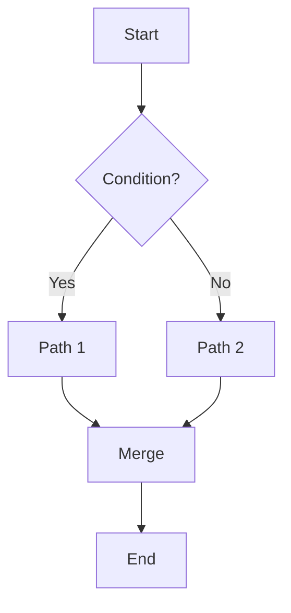

# Mermaid 分岐プレビュー（ローカル）

`tools/mermaid/mermaid-preview.html` は、Mermaid 記法の図をローカル環境で手軽にプレビューするためのツールです。分岐（特定ノード）のハイライト、テーマ切替、SVG ダウンロードに対応します。

## できること
- ノード ID を指定してハイライト（複数可、カンマ区切り）
- ダーク/ライトのテーマ切替
- 生成された SVG のダウンロード
- サンプル図の読み込み（動作確認用）

## 使い方
1. ファイルを開く
   - `tools/mermaid/mermaid-preview.html` をブラウザで開きます（ダブルクリック可）。
2. ハイライトしたいノード ID を入力
   - 例: `B,C`
3. Mermaid 記法を貼り付けて「Render」を押す
   - 画面右側にSVGで表示されます
4. 必要に応じて「Toggle Dark/Light」「Download SVG」を使用

> 注: ハイライトは `classDef highlight` と `class id1,id2 highlight;` をレンダリング前に自動追記することで実現しています。ノード ID は図内の宣言（例: `A[Start]` なら `A`）に一致させてください。

## 例（flowchart）

## 既知の注意
- 本ツールは CDN から Mermaid を読み込みます。オフライン環境では別途バンドル版を同梱する必要があります。
- セキュリティレベルは `strict` として初期化しています（HTML などの埋め込みは無効）。
